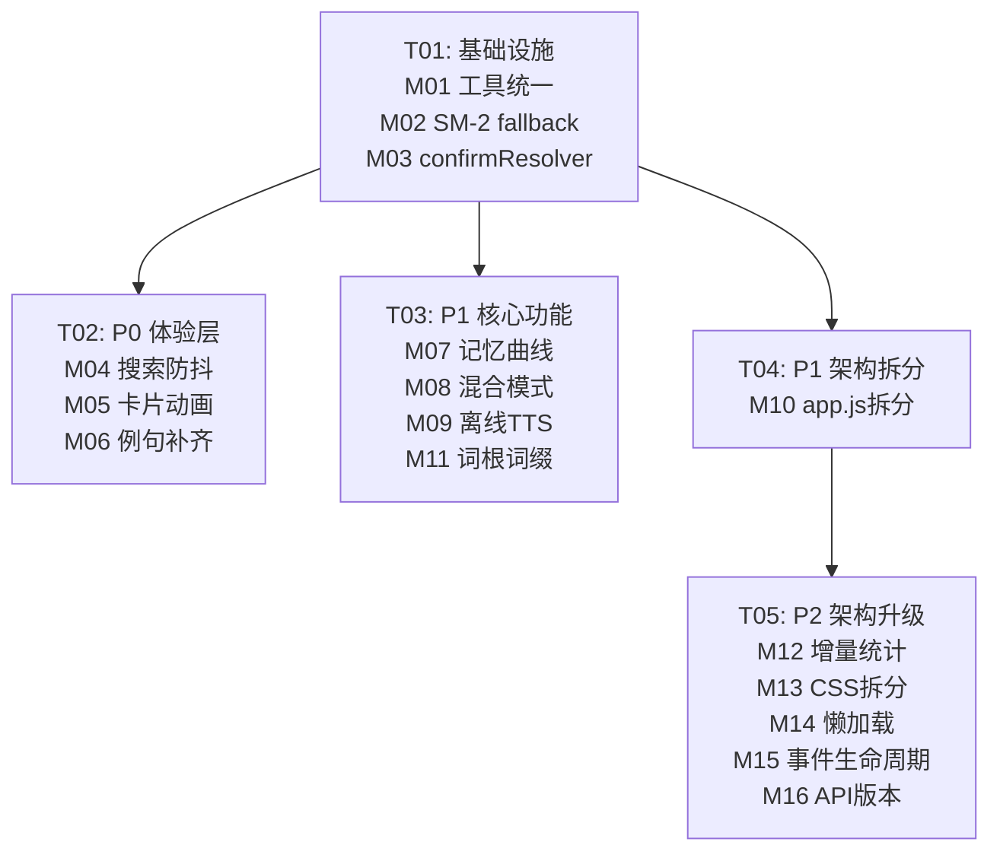
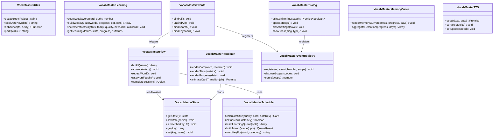
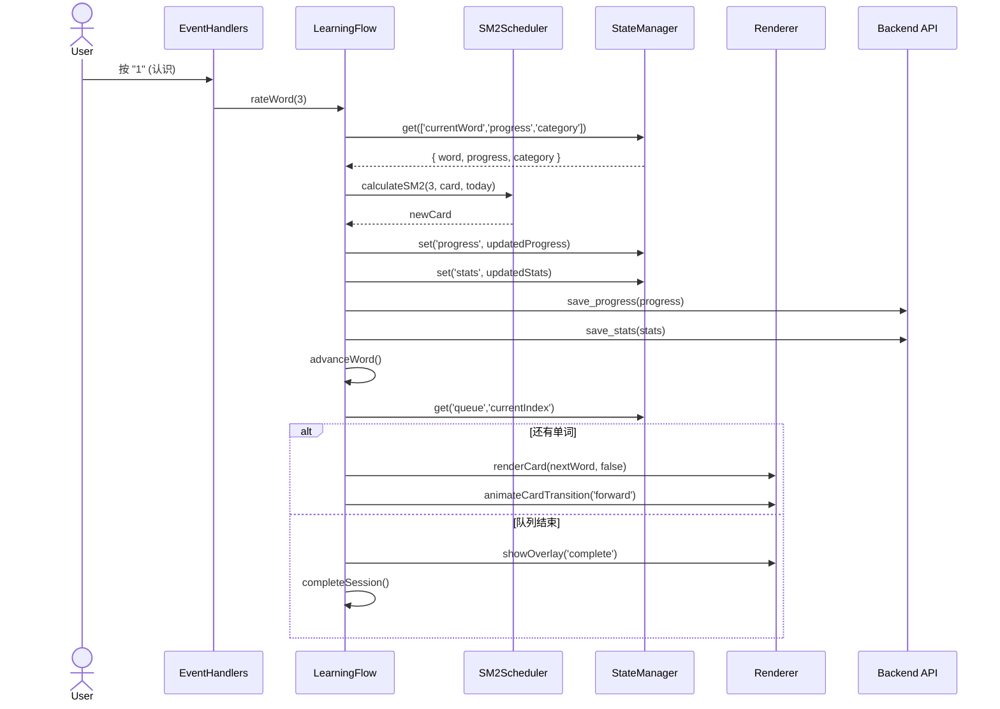

# VocabMaster v2.1 技术实施方案

> **文档版本**: 1.0
> **架构师**: 高见远（Bob）
> **日期**: 2025-07-18
> **基线版本**: v2.0.0
> **目标版本**: v2.1.0 / v2.2.0

---

## 1. 整体架构概览

### 当前架构（v2.0.0）

```
┌─────────────────────────────────────────────────────────┐
│                      index.html                         │
│  ┌──────────────────────────────────────────────────┐   │
│  │  script 标签按序加载（IIFE → window 命名空间）     │   │
│  │  core-utils.js → learning-intelligence.js →       │   │
│  │  sm2-scheduler.js → search-utils.js →             │   │
│  │  stats-renderer.js → settings-ui.js →             │   │
│  │  backup-actions.js → word-form.js →               │   │
│  │  error-book.js → keyboard-shortcuts.js →          │   │
│  │  app.js (2848行，全局状态 + 所有逻辑)               │   │
│  └──────────────────────────────────────────────────┘   │
│                    styles.css (2673行)                   │
├─────────────────────────────────────────────────────────┤
│              pywebview.api → app.py (Api class)          │
│              progress.json / stats.json / settings.json  │
└─────────────────────────────────────────────────────────┘
```

### 目标架构（v2.2.0）

```
┌─────────────────────────────────────────────────────────┐
│                      index.html                         │
│  ┌──────────────────────────────────────────────────┐   │
│  │  核心层: core-utils.js (统一工具)                  │   │
│  │  数据层: state-manager.js + learning-intelligence │   │
│  │  业务层: learning-flow.js + sm2-scheduler.js      │   │
│  │  渲染层: renderer.js + stats-renderer.js          │   │
│  │  UI层: dialog-manager.js + event-handlers.js      │   │
│  │  + event-registry.js + tts.js + memory-curve.js   │   │
│  │  入口: app.js (≤200行，编排)                       │   │
│  └──────────────────────────────────────────────────┘   │
│  base.css + card.css + stats.css + dialogs.css          │
│  + search.css + dark-mode.css (共6文件)                  │
├─────────────────────────────────────────────────────────┤
│           pywebview.api → app.py (/v2/ prefix)           │
│          + tts.py (Piper TTS 引擎)                       │
│          + Paginated APIs                                │
└─────────────────────────────────────────────────────────┘
```

---

## Part A: 系统设计

### A.1 实现方案总览

| 层面 | 当前问题 | 目标方案 |
|------|---------|---------|
| **模块化** | IIFE → window 命名空间，无构建工具 | 保持 IIFE 模式，通过明确 window 命名空间通信，不引入 Rollup/esbuild |
| **状态管理** | 全局 state 对象散落在 app.js | `state-manager.js` 集中管理，提供 get/set/subscribe API |
| **渲染** | DOM 操作与业务逻辑混杂 | `renderer.js` 纯渲染层，通过传入数据驱动 |
| **事件** | addEventListener 分散，无统一注销 | `event-registry.js` scope 化注册/批量解绑 |
| **CSS** | 单文件 2673 行 | 6 组件文件 + @import 聚合 |
| **后端** | API 无版本前缀 | `/v2/` 前缀 + VERSION 文件驱动 |

---

## 2. 模块详细技术方案

---

### M01 — 统一 localDateKey / escapeHtml 到 core-utils.js

**优先级**: P0 | **依赖**: 无 | **工期**: 0.5天

#### 2.1 技术方案概述

将 `localDateKey`（当前在 `app.js` L8-11、`sm2-scheduler.js` L16-22、`learning-intelligence.js` L14-19、`stats-renderer.js` L51-56、`error-book.js` L23-29 各有一份）和 `escapeHtml`（当前在 `app.js` L7、`stats-renderer.js` L10-17、`error-book.js` L9-17、`search-utils.js` L10-17 各有一份 fallback）统一到 `core-utils.js` 作为唯一权威来源。`core-utils.js` 新增 `debounce` 函数（后续 M04 使用）。

#### 2.2 关键代码变更

**文件 1: `src/core-utils.js` — 新增导出**

```javascript
// src/core-utils.js — 在 return 语句中新增导出
// 当前 L31: return { escapeHtml, localDateKey };
// 改为:
return {
  escapeHtml,
  localDateKey,
  debounce,    // 新增: 函数防抖
  pad2         // 新增: 通用补零（避免其他模块重复定义）
};
```

新增函数实现（插入在 `escapeHtml` 之后、`return` 之前）:

```javascript
// src/core-utils.js ~L30 新增
function debounce(fn, delay = 200) {
  let timer = null;
  return function (...args) {
    clearTimeout(timer);
    timer = setTimeout(() => fn.apply(this, args), delay);
  };
}
```

**文件 2: `src/sm2-scheduler.js` — 删除重复定义**

```javascript
// sm2-scheduler.js L12-22: 删除 pad2 和 localDateKey 定义
// 改为通过 window.VocabMasterUtils 引用:
const { localDateKey, pad2 } = window.VocabMasterUtils;
// 注意: addDays 内部使用 localDateKey，保持不变
```

**文件 3: `src/learning-intelligence.js` — 删除重复定义**

```javascript
// learning-intelligence.js L10-19: 删除 wordKeyFor 和 localDateKey 定义
// wordKeyFor: 改为从 window.VocabMasterScheduler 引用
const { wordKeyFor } = window.VocabMasterScheduler;
const { localDateKey } = window.VocabMasterUtils;
```

**文件 4: `src/error-book.js` — 删除重复定义**

```javascript
// error-book.js L9-29: 删除 _escapeHtml fallback 和 localDateKey 定义
// 改为直接引用:
const { escapeHtml, localDateKey } = window.VocabMasterUtils;
```

**文件 5: `src/stats-renderer.js` — 删除重复定义**

```javascript
// stats-renderer.js L10-17 和 L51-56: 删除 escapeHtml 和 localDateKey 定义
// 改为:
const { escapeHtml, localDateKey } = window.VocabMasterUtils;
```

**文件 6: `src/app.js` — 删除 fallback**

```javascript
// app.js L6-12: 删除解构默认值中的 escapeHtml 和 localDateKey fallback 实现
// 改为:
const { escapeHtml, localDateKey, debounce } = window.VocabMasterUtils || {};
// 如果 VocabMasterUtils 未加载，这些值为 undefined，
// 后续调用会抛出明确错误（而非静默使用 fallback）
```

#### 2.3 数据流与接口

```
window.VocabMasterUtils (core-utils.js)
├── escapeHtml(value: string): string
├── localDateKey(date?: Date): string  // "YYYY-MM-DD"
├── debounce(fn: Function, delay: number): Function
└── pad2(value: number): string

所有模块通过 window.VocabMasterUtils.xxx() 调用
```

#### 2.4 风险评估与边界处理

| 风险 | 概率 | 影响 | 缓解措施 |
|------|------|------|---------|
| `window.VocabMasterUtils` 未加载 | 低 | 高 | `app.js` 初始化时检查，若 undefined 则 alert 并拒绝启动 |
| `sm2-scheduler.js` 加载早于 `core-utils.js` | 低 | 高 | `index.html` 中 `core-utils.js` 必须在所有模块之前加载（当前已如此） |
| `wordKeyFor` 从 scheduler 引用导致循环 | 低 | 中 | `learning-intelligence.js` 不直接实现 wordKeyFor，引用 scheduler |

#### 2.5 测试策略

- **单元测试**: `core-utils.test.js` 增加 `debounce` 测试用例（jest fake timers）
- **集成测试**: 验证所有模块调用 `VocabMasterUtils.escapeHtml` 输出一致
- **E2E**: Playwright 回归测试全部通过
- **验证脚本**: `grep -rn "function localDateKey\|function escapeHtml" src/` 仅在 `core-utils.js` 有定义

---

### M02 — 删除 app.js 中 SM-2 fallback

**优先级**: P0 | **依赖**: M01 | **工期**: 0.25天

#### 2.6 技术方案概述

`app.js` L25-30 对 `calculateSM2`、`isDue`、`buildLearningQueue`、`wordKeyFor` 提供 `= null` fallback。当 `sm2-scheduler.js` 加载失败时静默降级为空函数，学习排程逻辑失效而不报错。改为：若 `window.VocabMasterScheduler` 未加载则抛出明确错误。

#### 2.7 关键代码变更

**文件: `src/app.js` L25-30**

```javascript
// 删除前 (当前代码):
const {
  calculateSM2 = null,
  isDue: schedulerIsDue = null,
  buildLearningQueue = null,
  wordKeyFor: schedulerWordKeyFor = null
} = window.VocabMasterScheduler || {};

// 改为:
const _scheduler = window.VocabMasterScheduler;
if (!_scheduler) {
  throw new Error('[VocabMaster] sm2-scheduler.js 未加载，请检查 index.html 脚本顺序');
}
const {
  calculateSM2,
  isDue: schedulerIsDue,
  buildLearningQueue,
  wordKeyFor: schedulerWordKeyFor
} = _scheduler;
```

同时需要检查所有调用点是否对 `null` 返回值做了防御性处理。在 `app.js` 中搜索 `calculateSM2?.(` 和 `buildLearningQueue?.(` 调用，确认它们使用 `if (calculateSM2)` 守卫，将其改为直接调用（因为现在保证非 null）。

#### 2.8 数据流与接口

```
app.js 初始化时:
  if (!window.VocabMasterScheduler) → throw Error (阻断启动)
  else → 正常解构，类型安全
```

#### 2.9 风险评估

| 风险 | 概率 | 影响 | 缓解措施 |
|------|------|------|---------|
| 现有代码依赖 `= null` 进行条件调用 | 中 | 中 | 搜索所有 `xxx?.()` 调用，改为直接调用 |
| 破坏现有 E2E 测试 | 低 | 低 | E2E 测试确保 scheduler 正常加载 |

#### 2.10 测试策略

- **单元测试**: 模拟 `window.VocabMasterScheduler` 未定义，验证抛出明确错误
- **E2E**: 确保正常加载路径不受影响

---

### M03 — 修复 confirmResolver 竞态

**优先级**: P0 | **依赖**: 无（可独立） | **工期**: 0.5天

#### 2.11 技术方案概述

当前 `confirmResolver` 为全局单例（`app.js` L1589），连续快速弹窗时新弹窗会覆盖旧 resolver，导致旧 Promise 永不 resolve（界面卡死）。改为**队列化处理**：同时只有一个活跃弹窗，后续请求排队；新请求到来时 reject 旧 Promise 并显示新弹窗（栈式覆盖 + 明确 reject）。

#### 2.12 关键代码变更

**文件: `src/app.js` L1589-1615**

```javascript
// --- 删除旧实现 ---
// let confirmResolver = null;  // 删除

// --- 新实现 ---
// src/app.js ~L1589 新增
const ConfirmQueue = {
  _pending: null,       // { resolve, reject }
  _queue: [],           // 待处理队列

  enqueue(message) {
    // 如果有正在等待的弹窗，先 reject 旧 Promise
    if (this._pending) {
      this._pending.reject(new Error('CONFIRM_SUPERSEDED'));
      this._pending = null;
    }
    // 显示新弹窗
    showConfirmOverlay(message);
    return new Promise((resolve, reject) => {
      this._pending = { resolve, reject };
    });
  },

  resolve(accepted) {
    if (this._pending) {
      const { resolve } = this._pending;
      this._pending = null;
      resolve(Boolean(accepted));
    }
    // 处理队列中的下一个
    this._processQueue();
  },

  _processQueue() {
    // 如果队列非空且无活跃弹窗，出队显示
    if (this._queue.length > 0 && !this._pending) {
      const next = this._queue.shift();
      this.enqueue(next.message).then(next.resolve).catch(next.reject);
    }
  },

  clear() {
    if (this._pending) {
      this._pending.reject(new Error('CONFIRM_CANCELLED'));
      this._pending = null;
    }
    this._queue.forEach(item =>
      item.reject(new Error('CONFIRM_CANCELLED'))
    );
    this._queue = [];
  }
};

// askConfirm 改为:
function askConfirm(message) {
  return ConfirmQueue.enqueue(message);
}

// closeConfirmDialog 改为:
function closeConfirmDialog(accepted = false) {
  hideConfirmOverlay();
  ConfirmQueue.resolve(accepted);
}

// showConfirmOverlay (提取纯 UI 逻辑):
function showConfirmOverlay(message) {
  const overlay = $('#confirm-overlay');
  const messageEl = $('#confirm-message');
  if (!overlay || !messageEl) return;
  messageEl.textContent = message;
  overlay.classList.remove('hidden');
  activateDialog(overlay, $('#btn-confirm-ok'));
}

function hideConfirmOverlay() {
  const overlay = $('#confirm-overlay');
  if (overlay) overlay.classList.add('hidden');
  deactivateDialog(overlay);
}
```

#### 2.13 数据流与接口

```
调用方                     ConfirmQueue                DOM
  │                            │                        │
  ├─ askConfirm("确认删除?") ──→│ enqueue()              │
  │                            ├─ reject 旧 pending     │
  │                            ├─ showConfirmOverlay() ─→│ 显示弹窗
  │                            └─ return new Promise    │
  │                                                      │
  │                      用户点击"确定"                   │
  │                            │  closeConfirmDialog(true)
  │                            ├─ hideConfirmOverlay() ─→│ 隐藏弹窗
  │                            ├─ resolve(true)         │
  │  ←── Promise resolved ────┘                         │
```

#### 2.14 风险评估

| 风险 | 概率 | 影响 | 缓解措施 |
|------|------|------|---------|
| CONFIRM_SUPERSEDED 被调用方吞掉 | 中 | 低 | 文档说明调用方需 `.catch()` 处理 SUPERSEDED |
| 弹窗关闭（ESC/点击外部）未调用 resolve | 中 | 高 | 所有关闭路径统一通过 `closeConfirmDialog(false)` |

#### 2.15 测试策略

- **单元测试**: 连续 3 次 `askConfirm`，验证每个都 resolve/reject
- **E2E**: 新增竞态场景：快速点击"重置进度"→"清空错题本"→"删除单词"，验证不卡死
- **内存测试**: 验证无悬挂 Promise（使用 Chrome DevTools Performance 录制）

---

### M04 — 搜索 200ms 防抖

**优先级**: P0 | **依赖**: M01 (debounce) | **工期**: 0.25天

#### 2.16 技术方案概述

当前搜索已有 150ms 防抖（`app.js` L1910），改为 200ms 并使用 `core-utils.js` 中的 `debounce` 函数，防抖延迟通过常量 `SEARCH_DEBOUNCE_MS` 可配置。

#### 2.17 关键代码变更

**文件: `src/app.js` L1898-1931**

```javascript
// src/app.js — initSearch() 函数修改

// 当前 L1903: let debounceTimer;
// 当前 L1905-1911: input.addEventListener('input', () => { ... setTimeout(..., 150) });
// 改为:

const SEARCH_DEBOUNCE_MS = 200;  // 可配置常量

function initSearch() {
  const input = $('#word-search');
  const clearBtn = $('#btn-search-clear');
  const results = $('#search-results');

  // 使用 core-utils 的 debounce
  const debouncedFilter = window.VocabMasterUtils.debounce((query) => {
    if (!query) { results.classList.remove('show'); return; }
    filterWords(query);
  }, SEARCH_DEBOUNCE_MS);

  input.addEventListener('input', () => {
    const val = input.value.trim();
    clearBtn.classList.toggle('hidden', !val);
    debouncedFilter(val.toLowerCase());
  });

  // ... 其余保持不变
}
```

#### 2.18 性能目标

```
快速连续输入 5 字符 → 仅 1 次 filterWords() 调用
P95 搜索响应 < 100ms（基于 TOEFL 词库 6974 词）
```

#### 2.19 测试策略

- **单元测试**: `core-utils.test.js` 中 `debounce` 测试（fake timers）
- **集成测试**: Playwright 快速输入 5 字符，检查 `filterWords` 调用次数
- **性能测试**: TOEFL 词库下搜索响应时间测量

---

### M05 — 卡片 CSS transition 0.2s

**优先级**: P0 | **依赖**: 无 | **工期**: 0.5天

#### 2.20 技术方案概述

单词卡片切换时通过 CSS transition 实现平滑过渡。前进（→）右滑入、后退（←）左滑入。使用 `transform: translateX()` + `opacity`，GPU 加速（`will-change`），动画期间 `pointer-events: none` 防止误触。

#### 2.21 关键代码变更

**文件 1: `src/styles.css` — 新增 transition 规则**

```css
/* src/styles.css — 在 .word-card 规则块中新增 */

.word-card {
  transition: opacity 0.2s ease-out, transform 0.2s ease-out;
  will-change: transform, opacity;
}

/* 前进时旧卡片状态 */
.word-card.slide-forward-out {
  opacity: 0;
  transform: translateX(-20px);
  pointer-events: none;
}

/* 后退时旧卡片状态 */
.word-card.slide-backward-out {
  opacity: 0;
  transform: translateX(20px);
  pointer-events: none;
}

/* 新卡片进入起始状态 */
.word-card.slide-enter {
  opacity: 0;
}

.word-card.slide-forward-enter {
  transform: translateX(20px);
}

.word-card.slide-backward-enter {
  transform: translateX(-20px);
}
```

**文件 2: `src/app.js` — 切换逻辑添加类名触发**

```javascript
// src/app.js — renderCard 或等效的卡片切换函数

// 切换方向常量
const SLIDE_FORWARD = 'forward';
const SLIDE_BACKWARD = 'backward';

function transitionCard(direction) {
  const card = $('#word-card');
  if (!card) return;

  // 1) 设置退出动画
  const outClass = direction === SLIDE_FORWARD
    ? 'slide-forward-out'
    : 'slide-backward-out';
  card.classList.add(outClass);

  // 2) 200ms 后清除旧类名、渲染新内容、设置进入动画
  setTimeout(() => {
    card.classList.remove(outClass, 'slide-enter',
      'slide-forward-enter', 'slide-backward-enter');

    // 渲染新卡片内容
    renderCurrentWord();

    // 设置进入动画
    const enterClass = direction === SLIDE_FORWARD
      ? 'slide-forward-enter'
      : 'slide-backward-enter';
    card.classList.add('slide-enter', enterClass);

    // 触发 reflow 后移除进入类名（启动 transition）
    requestAnimationFrame(() => {
      requestAnimationFrame(() => {
        card.classList.remove('slide-enter',
          'slide-forward-enter', 'slide-backward-enter');
      });
    });
  }, 200);
}
```

#### 2.22 测试策略

- **视觉回归**: Playwright 截图对比，验证动画方向正确
- **交互测试**: 动画期间按快捷键（1/2/3/Space），确认不阻塞
- **深色模式**: 验证动画在深色模式下表现正常

---

### M06 — 例句补齐

**优先级**: P0 | **依赖**: 无（独立数据任务） | **工期**: 2天

#### 2.23 技术方案概述

对内置 5 个词库中缺失例句的词条，通过 AI 生成例句及中文翻译。优先补齐 CET-4（目标 ≥95% 覆盖率）和 CET-6（目标 ≥90% 覆盖率）。使用 Python 脚本调用 LLM API 生成例句，人工抽检 200 条验证质量。

#### 2.24 关键代码变更

**文件 1: `scripts/example_filler.py` — 新建**

```python
# scripts/example_filler.py
"""
例句补齐脚本 — 对词库 JSON 中缺失 example 字段的词条，
通过 LLM API (OpenAI-compatible) 生成高质量例句及中文翻译。
"""
import json
import sys
import os
from pathlib import Path

# 配置
WORDS_DIR = Path(__file__).parent.parent / 'src' / 'words'
TARGET_CATEGORIES = ['cet4', 'cet6', 'postgraduate', 'ielts', 'toefl']
DRY_RUN = '--dry-run' in sys.argv

# 批量大小 (避免 API 速率限制)
BATCH_SIZE = 20

def load_words(category: str) -> list[dict]:
    """加载词库 JSON。"""
    path = WORDS_DIR / f'{category}.json'
    with open(path, 'r', encoding='utf-8') as f:
        return json.load(f)

def save_words(category: str, words: list[dict]) -> None:
    """保存词库 JSON（带备份）。"""
    path = WORDS_DIR / f'{category}.json'
    backup = WORDS_DIR / f'{category}.json.bak'
    if path.exists():
        path.rename(backup)
    with open(path, 'w', encoding='utf-8') as f:
        json.dump(words, f, ensure_ascii=False, indent=2)

def find_missing(words: list[dict]) -> list[dict]:
    """找出缺失例句的词条。"""
    return [
        w for w in words
        if not w.get('example') or w.get('example') == '(该词暂无例句)'
    ]

def build_prompt(word: dict) -> str:
    """构建 LLM prompt。"""
    return (
        f"为英语单词 "{word['word']}" ({word.get('meaning', '')}) "
        f"生成一个自然实用的英文例句及其准确的中文翻译。\\n"
        f"返回格式: {{\\"example\\": \\"...\\", \\"exampleTranslation\\": \\"...\\"}}"
    )

def generate_examples(words: list[dict], api_key: str) -> list[dict]:
    """调用 LLM API 批量生成例句。"""
    # 实现取决于具体 LLM API
    # 使用 OpenAI-compatible chat/completions 接口
    # 返回添加了 example 和 exampleTranslation 字段的词条列表
    pass

def main():
    for cat in TARGET_CATEGORIES:
        words = load_words(cat)
        missing = find_missing(words)
        if not missing:
            print(f'{cat}: 例句已完整，跳过')
            continue
        print(f'{cat}: {len(missing)}/{len(words)} 条缺失例句')

        if DRY_RUN:
            continue

        # 分批生成
        for i in range(0, len(missing), BATCH_SIZE):
            batch = missing[i:i+BATCH_SIZE]
            filled = generate_examples(batch, os.environ.get('OPENAI_API_KEY', ''))
            # 更新原始列表
            for w in filled:
                for orig in words:
                    if orig['word'] == w['word']:
                        orig['example'] = w['example']
                        orig['exampleTranslation'] = w['exampleTranslation']
                        break
            print(f'  进度: {min(i+BATCH_SIZE, len(missing))}/{len(missing)}')

        save_words(cat, words)
        print(f'{cat}: 已保存')

if __name__ == '__main__':
    main()
```

**文件 2: 词库 JSON — 数据修改**

每个词库 JSON 条目新增/更新字段（批量生成结果）:
```json
{
  "word": "abandon",
  "phonetic": "/əˈbændən/",
  "meaning": "v. 放弃；抛弃",
  "example": "They had to abandon the project due to lack of funding.",
  "exampleTranslation": "由于缺乏资金，他们不得不放弃这个项目。"
}
```

#### 2.25 测试策略

- **覆盖率统计**: 脚本输出每个词库的覆盖率百分比
- **质量抽检**: 人工审查 200 条（每词库 40 条），检查语法正确性和翻译准确性
- **回归测试**: 确保例句更新的词条在学习流程中正确显示

---

### M07 — 记忆曲线可视化

**优先级**: P1 | **依赖**: M01 (core-utils) | **工期**: 3天

#### 2.26 技术方案概述

基于用户 SM-2 进度数据，使用 Canvas 绘制个人 Ebbinghaus 遗忘曲线。X 轴为时间（按 revision 间隔分布），Y 轴为记忆保持率（%），叠加理想 Ebbinghaus 参考曲线（虚线）。支持 7/14/30 天视图切换。从 `progress` 中聚合每个单词的 `ef` 和 `repetitions` 数据。

#### 2.27 关键代码变更

**文件 1: `src/memory-curve.js` — 新建**

```javascript
// src/memory-curve.js
(function (root, factory) {
  const api = factory();
  if (typeof module === 'object' && module.exports) { module.exports = api; }
  if (root) { root.VocabMasterMemoryCurve = api; }
})(typeof window !== 'undefined' ? window : globalThis, function () {

  // 理想 Ebbinghaus 遗忘曲线: R = e^(-t/S)
  // S = 相对记忆强度 (默认 1.0)
  const IDEAL_S = 1.0;

  /**
   * 从 progress 数据聚合记忆保持率
   * @param {Object} progress - SM-2 progress 数据
   * @param {number} days - 回溯天数 (7/14/30)
   * @returns {Array<{day: number, retention: number}>}
   */
  function aggregateRetention(progress, days = 30) {
    const cards = Object.values(progress || {});
    if (cards.length === 0) return [];

    // 按 interval 分组，计算每组平均 ef
    const byInterval = {};
    cards.forEach(card => {
      if (!card || card.repetitions < 1) return;
      const interval = Math.min(card.interval || 0, days);
      if (!byInterval[interval]) byInterval[interval] = [];
      byInterval[interval].push(card.ef || 2.5);
    });

    // 记忆保持率 = 1 - (1/ef)，ef 越高保持率越高
    const result = [];
    for (let day = 1; day <= days; day++) {
      const efs = byInterval[day] || [];
      if (efs.length > 0) {
        const avgEf = efs.reduce((a, b) => a + b, 0) / efs.length;
        result.push({ day, retention: Math.round((1 - 1 / avgEf) * 100) });
      }
    }
    return result;
  }

  /**
   * 理想 Ebbinghaus 曲线
   */
  function idealCurve(days) {
    const result = [];
    for (let day = 1; day <= days; day++) {
      // R = e^(-day * 0.2) 简化的遗忘曲线
      const retention = Math.round(Math.exp(-day * 0.2) * 100);
      result.push({ day, retention });
    }
    return result;
  }

  /**
   * 在指定 Canvas 上绘制记忆曲线
   */
  function renderMemoryCurve(canvas, progress, viewDays = 30) {
    if (!canvas) return;

    const ctx = canvas.getContext('2d');
    const dpr = window.devicePixelRatio || 1;
    const rect = canvas.getBoundingClientRect();
    canvas.width = rect.width * dpr;
    canvas.height = rect.height * dpr;
    ctx.scale(dpr, dpr);

    const w = rect.width, h = rect.height;
    ctx.clearRect(0, 0, w, h);

    const padding = { top: 30, right: 30, bottom: 45, left: 45 };
    const chartW = w - padding.left - padding.right;
    const chartH = h - padding.top - padding.bottom;

    // 背景网格
    const data = aggregateRetention(progress, viewDays);
    const ideal = idealCurve(viewDays);

    // 绘制坐标轴和网格
    drawGrid(ctx, padding, chartW, chartH, viewDays);

    // 绘制理想曲线 (虚线)
    drawLine(ctx, ideal, padding, chartW, chartH, viewDays,
      'rgba(47,111,115,0.4)', true, 2);

    // 绘制个人曲线 (实线)
    drawLine(ctx, data, padding, chartW, chartH, viewDays,
      '#2f6f73', false, 2);

    // 图例
    drawLegend(ctx, w);
  }

  function drawGrid(ctx, pad, cw, ch, days) {
    ctx.strokeStyle = '#e0e5ea';
    ctx.lineWidth = 0.5;
    for (let pct = 0; pct <= 100; pct += 20) {
      const y = pad.top + ch - (pct / 100) * ch;
      ctx.beginPath();
      ctx.moveTo(pad.left, y);
      ctx.lineTo(pad.left + cw, y);
      ctx.stroke();
      ctx.fillStyle = '#6d7a8c';
      ctx.font = '11px sans-serif';
      ctx.textAlign = 'right';
      ctx.fillText(pct + '%', pad.left - 6, y + 4);
    }

    // X 轴标注
    const step = days <= 7 ? 1 : days <= 14 ? 2 : 5;
    for (let d = 1; d <= days; d += step) {
      const x = pad.left + ((d - 1) / (days - 1)) * cw;
      ctx.fillStyle = '#6d7a8c';
      ctx.textAlign = 'center';
      ctx.fillText('D' + d, x, pad.top + ch + 16);
    }
  }

  function drawLine(ctx, points, pad, cw, ch, days, color, dashed, lw) {
    if (!points || points.length < 2) return;
    ctx.strokeStyle = color;
    ctx.lineWidth = lw || 2;
    if (dashed) ctx.setLineDash([6, 4]);
    else ctx.setLineDash([]);
    ctx.lineJoin = 'round';
    ctx.lineCap = 'round';

    ctx.beginPath();
    points.forEach((pt, i) => {
      const x = pad.left + ((pt.day - 1) / (days - 1)) * cw;
      const y = pad.top + ch - (pt.retention / 100) * ch;
      if (i === 0) ctx.moveTo(x, y);
      else ctx.lineTo(x, y);
    });
    ctx.stroke();
    ctx.setLineDash([]); // reset

    // 数据点圆点
    points.forEach(pt => {
      const x = pad.left + ((pt.day - 1) / (days - 1)) * cw;
      const y = pad.top + ch - (pt.retention / 100) * ch;
      ctx.fillStyle = color;
      ctx.beginPath();
      ctx.arc(x, y, 3, 0, Math.PI * 2);
      ctx.fill();
    });
  }

  function drawLegend(ctx, w) {
    const lx = w - 180, ly = 8;
    ctx.fillStyle = '#2f6f73';
    ctx.fillRect(lx, ly, 16, 3);
    ctx.fillStyle = '#2c3e50';
    ctx.font = '11px sans-serif';
    ctx.textAlign = 'left';
    ctx.fillText('个人曲线', lx + 22, ly + 5);

    ctx.setLineDash([4, 3]);
    ctx.strokeStyle = 'rgba(47,111,115,0.4)';
    ctx.lineWidth = 2;
    ctx.beginPath();
    ctx.moveTo(lx + 90, ly + 2);
    ctx.lineTo(lx + 106, ly + 2);
    ctx.stroke();
    ctx.setLineDash([]);
    ctx.fillText('理想曲线', lx + 112, ly + 5);
  }

  return { renderMemoryCurve, aggregateRetention };
});
```

**文件 2: `src/stats-renderer.js` — 集成入口（修改）**

在统计面板 HTML 中新增 Canvas 容器，并在打开统计面板时调用 `renderMemoryCurve`。

**文件 3: `src/styles.css` — 面板样式**

```css
/* 记忆曲线面板 */
.memory-curve-panel {
  background: var(--bg-card);
  border-radius: var(--radius-md);
  padding: 16px;
  margin-bottom: 16px;
}
.memory-curve-header {
  display: flex;
  justify-content: space-between;
  align-items: center;
  margin-bottom: 12px;
}
.memory-curve-tabs {
  display: flex;
  gap: 4px;
  background: var(--bg-secondary);
  border-radius: 6px;
  padding: 2px;
}
.memory-curve-tab {
  padding: 4px 16px;
  border: none;
  border-radius: 4px;
  font-size: 13px;
  cursor: pointer;
  background: transparent;
  color: var(--text-secondary);
}
.memory-curve-tab.active {
  background: var(--bg-white);
  color: var(--accent);
  font-weight: 600;
  box-shadow: var(--shadow-sm);
}
```

**文件 4: `src/index.html` — 新 script 引用**

```html
<!-- 在 app.js 之前加载 -->
<script src="memory-curve.js"></script>
```

#### 2.28 数据流与接口

```
Stats overlay 打开
  │
  ├→ state.progress (SM-2 数据)
  │     └→ MemoryCurve.aggregateRetention(progress, viewDays)
  │           └→ [{day:1, retention:85}, {day:3, retention:63}, ...]
  │
  ├→ MemoryCurve.renderMemoryCurve(canvas, progress, 30)
  │     ├→ 绘制网格
  │     ├→ 绘制理想曲线 (rgba(47,111,115,0.4) 虚线)
  │     ├→ 绘制个人曲线 (#2f6f73 实线)
  │     └→ 绘制图例
  │
  └→ 用户点击 [7天]/[14天]/[30天] → 重新 render
```

#### 2.29 风险评估

| 风险 | 概率 | 影响 | 缓解措施 |
|------|------|------|---------|
| progress 数据为空 | 高 | 低 | 显示"暂无数据，开始学习后生成曲线"占位文字 |
| Canvas 尺寸为 0 | 低 | 中 | 监听 overlay 显示后再 render |
| 数据点太少（<2个）曲线无法绘制 | 中 | 低 | 最少 2 个数据点才绘制折线 |
| 深色模式 Canvas 颜色不适配 | 中 | 中 | 绘制前读取 CSS 变量或 body 类名判断 |

#### 2.30 测试策略

- **单元测试**: `aggregateRetention` 对空 progress、单卡、多卡返回正确
- **性能测试**: TOEFL 6974 词 progress 下 render 时间 P95 < 50ms
- **视觉测试**: Playwright 截图对比 7/14/30 天视图
- **深色模式**: 切换深色模式后曲线重新渲染

---

### M08 — 学习模式自动混合

**优先级**: P1 | **依赖**: M01, M02, M05 | **工期**: 3天

#### 2.31 技术方案概述

新增"智能混合"模式（默认）：优先推送到期复习词 → 复习完后无缝衔接新学词 → 达到每日目标。保留独立的"复习"/"新学"/"强化"/"测试"模式。UI 上模式切换栏新增"混合"选项，进度条分段显示复习和新学进度。

#### 2.32 关键代码变更

**文件 1: `src/sm2-scheduler.js` — 新增 buildMixedQueue**

```javascript
// sm2-scheduler.js — 新增导出
/**
 * 构建混合学习队列
 * @param {Object} options
 * @param {Array} options.words - 词库全部单词
 * @param {Object} options.progress - SM-2 progress
 * @param {string} options.category - 当前词库
 * @param {Object} options.settings - { dailyGoal, ... }
 * @param {string} [options.today] - 日期键
 * @returns {{ queue: Array, reviewCount: number, newCount: number }}
 */
function buildMixedQueue({
  words, progress, category, settings, today,
  shuffleFn = defaultShuffle
}) {
  const dateKey = today || localDateKey();
  const allWords = Array.isArray(words) ? words : [];
  const allProgress = progress || {};
  const dailyGoal = (settings && settings.dailyGoal) || 30;

  // Step 1: 收集到期复习词
  const dueWords = buildDueWords(allWords, allProgress, category, dateKey);

  // Step 2: 计算还需多少新词
  const remainingSlots = Math.max(0, dailyGoal - dueWords.length);

  // Step 3: 取未学习的词
  const newWords = remainingSlots > 0
    ? allWords.filter(w => {
        const card = allProgress[wordKeyFor(w, category)];
        return !card || card.repetitions === 0;
      })
    : [];

  const selectedNew = shuffleFn(newWords).slice(0, remainingSlots);

  return {
    queue: [...dueWords, ...selectedNew],
    reviewCount: dueWords.length,
    newCount: selectedNew.length
  };
}

// 在 return 语句中新增导出
return {
  calculateSM2,
  isDue,
  buildLearningQueue,
  buildMixedQueue,   // 新增
  wordKeyFor
};
```

**文件 2: `src/app.js` — 模式切换 UI 集成**

```javascript
// app.js — 模式定义新增 'mixed'
const MODES = ['mixed', 'review', 'new', 'weak', 'test'];
const DEFAULT_MODE = 'mixed';  // 默认改为混合

// 模式切换处理
function switchMode(mode) {
  if (!MODES.includes(mode)) return;
  state.mode = mode;

  let queue;
  if (mode === 'mixed') {
    const result = buildMixedQueue({
      words: state.wordList,
      progress: state.progress,
      category: state.category,
      settings: state.settings,
      today: localDateKey()
    });
    queue = result.queue;
    state.reviewCount = result.reviewCount;
    state.newCount = result.newCount;
  } else {
    queue = buildLearningQueue({
      words: state.wordList,
      progress: state.progress,
      category: state.category,
      mode,
      settings: state.settings,
      today: localDateKey(),
      buildWeakQueue
    });
  }

  state.queue = queue;
  state.currentIndex = 0;
  updateProgressBar();  // 分段进度条
  renderCard();
}
```

**文件 3: `src/styles.css` — 混合模式 UI**

```css
/* 模式切换栏新增混合选项 */
.mode-tab[data-mode="mixed"] { color: var(--accent); }
.mode-tab[data-mode="mixed"].active {
  background: var(--accent-light);
  color: var(--accent-dark);
  font-weight: 700;
}

/* 分段进度条 */
.progress-bar-segmented {
  display: flex;
  height: 6px;
  border-radius: 3px;
  overflow: hidden;
  gap: 2px;
  background: var(--bg-hover);
}
.progress-segment-review {
  background: var(--accent);       /* 复习色 #2f6f73 */
  transition: width 0.3s ease;
}
.progress-segment-new {
  background: var(--warning);      /* 新学色 #b7791f */
  transition: width 0.3s ease;
}

/* 卡片类型标签 */
.card-type-badge {
  position: absolute;
  top: 12px;
  right: 52px;
  font-size: 11px;
  padding: 2px 8px;
  border-radius: 4px;
  font-weight: 600;
}
.card-type-badge.review {
  background: var(--accent-light);
  color: var(--accent);
}
.card-type-badge.new {
  background: var(--warning-light);
  color: var(--warning);
}
```

#### 2.33 数据流

```
buildMixedQueue()
  ├→ buildDueWords()              → reviewWords[]
  ├→ filter(no progress)          → newWords[]
  ├→ shuffle + slice(remaining)   → selectedNew[]
  └→ return { queue: [...review, ...new], reviewCount, newCount }

renderCard() → 检查当前词是否在 reviewWords 中 → 显示 "复习"/"新学" badge
updateProgressBar() → 分段进度条: ████░░░░░░ 复习 6/10 · 新学 4/20
```

#### 2.34 风险评估

| 风险 | 概率 | 影响 | 缓解措施 |
|------|------|------|---------|
| 混合模式下 review + new 超过 dailyGoal | 低 | 低 | buildMixedQueue 确保 queue.length ≤ dailyGoal |
| 用户在混合模式中途切词库 | 低 | 中 | 切换词库时重新构建队列 |
| 进度条分段计算错误 | 低 | 低 | 单元测试验证 reviewCount + newCount = queue.length |

#### 2.35 测试策略

- **单元测试**: `sm2-scheduler.test.js` 新增 `buildMixedQueue` 测试
- **集成测试**: 验证混合模式队列顺序（复习在前、新学在后）
- **E2E**: 首次打开应用默认进入混合模式、切换回 "复习" 模式不受影响

---

### M09 — 离线 TTS 发音升级

**优先级**: P1 | **依赖**: 无（独立） | **工期**: 4天

#### 2.36 技术方案概述

嵌入 Piper TTS（~50MB 模型），通过 pywebview JS-API 桥接。前端 `tts.js` 封装统一接口，后端 `tts.py` 管理 Piper 引擎生命周期。支持英音/美音切换和 3 档语速。

#### 2.37 关键代码变更

**文件 1: `app.py` — 新增 tts.py 模块导入**

```python
# app.py — Api 类中新增方法

class Api:
    def __init__(self):
        # ... 现有初始化
        self._tts = None  # 延迟加载

    def tts_speak(self, text: str, voice: str = 'en-US', speed: float = 1.0):
        """发音请求。voice: 'en-US' | 'en-GB', speed: 0.8 | 1.0 | 1.2"""
        if self._tts is None:
            from tts import PiperTTS
            self._tts = PiperTTS()
        return self._tts.synthesize(text, voice, speed)

    def tts_get_voices(self):
        """返回可用语音列表。"""
        return [
            {'id': 'en-US', 'name': '美音 (American)', 'icon': '🇺🇸'},
            {'id': 'en-GB', 'name': '英音 (British)', 'icon': '🇬🇧'}
        ]
```

**文件 2: `tts.py` — 新建后端 TTS 模块**

```python
# tts.py
"""
Piper TTS 引擎封装 — 离线高质量语音合成。
模型文件放在 data/piper_models/ 目录下。
首次运行时下载模型（~50MB）。
"""
import subprocess
import tempfile
import os
from pathlib import Path

MODEL_DIR = Path(__file__).parent / 'data' / 'piper_models'

VOICE_MODELS = {
    'en-US': {
        'model': MODEL_DIR / 'en_US-lessac-medium.onnx',
        'config': MODEL_DIR / 'en_US-lessac-medium.onnx.json',
        'url': 'https://huggingface.co/rhasspy/piper-voices/resolve/main/en/en_US/lessac/medium/en_US-lessac-medium.onnx'
    },
    'en-GB': {
        'model': MODEL_DIR / 'en_GB-alan-medium.onnx',
        'config': MODEL_DIR / 'en_GB-alan-medium.onnx.json',
        'url': '...'
    }
}

class PiperTTS:
    def __init__(self):
        self._ensure_models()
        self._current_voice = 'en-US'

    def _ensure_models(self):
        """确保模型文件存在，缺失时自动下载。"""
        MODEL_DIR.mkdir(parents=True, exist_ok=True)
        # 检查并下载逻辑...

    def synthesize(self, text: str, voice: str = 'en-US',
                   speed: float = 1.0) -> bytes:
        """合成语音，返回 WAV 字节流。"""
        model_info = VOICE_MODELS.get(voice, VOICE_MODELS['en-US'])

        with tempfile.NamedTemporaryFile(suffix='.wav', delete=False) as tmp:
            out_path = tmp.name

        # 调用 piper 命令行
        cmd = [
            'piper',
            '--model', str(model_info['model']),
            '--config', str(model_info['config']),
            '--length_scale', str(1.0 / speed),  # 语速调节
            '--output_file', out_path
        ]
        proc = subprocess.run(cmd, input=text, capture_output=True, text=True)

        with open(out_path, 'rb') as f:
            audio_data = f.read()

        os.unlink(out_path)
        return audio_data
```

**文件 3: `src/tts.js` — 新建前端封装**

```javascript
// src/tts.js
(function (root, factory) {
  const api = factory();
  if (typeof module === 'object' && module.exports) { module.exports = api; }
  if (root) { root.VocabMasterTTS = api; }
})(typeof window !== 'undefined' ? window : globalThis, function () {

  const SPEED_PRESETS = { slow: 0.8, normal: 1.0, fast: 1.2 };

  let currentVoice = 'en-US';
  let currentSpeed = 1.0;
  let audioContext = null;

  function getAudioContext() {
    if (!audioContext) {
      audioContext = new (window.AudioContext || window.webkitAudioContext)();
    }
    return audioContext;
  }

  /**
   * 播放单词发音
   * @param {string} text - 要朗读的文本
   * @param {Object} options
   * @param {string} options.voice - 'en-US' | 'en-GB'
   * @param {string} options.speed - 'slow' | 'normal' | 'fast'
   */
  async function speak(text, options = {}) {
    const voice = options.voice || currentVoice;
    const speed = SPEED_PRESETS[options.speed] || currentSpeed;

    try {
      // 方案 A: 调用后端 Piper TTS
      const audioData = await window.pywebview.api.tts_speak(text, voice, speed);
      const audioBuffer = base64ToArrayBuffer(audioData);
      const ctx = getAudioContext();
      const decoded = await ctx.decodeAudioData(audioBuffer);
      const source = ctx.createBufferSource();
      source.buffer = decoded;
      source.connect(ctx.destination);
      source.start(0);
    } catch (e) {
      // 方案 B: 降级到 Web Speech API
      fallbackToWebSpeech(text, voice, speed);
    }
  }

  function fallbackToWebSpeech(text, voice, speed) {
    const utterance = new SpeechSynthesisUtterance(text);
    utterance.lang = voice;
    utterance.rate = speed;
    window.speechSynthesis.speak(utterance);
  }

  function setVoice(voice) { currentVoice = voice; }
  function setSpeed(speed) { currentSpeed = SPEED_PRESETS[speed] || 1.0; }
  function getVoice() { return currentVoice; }
  function getSpeed() { return currentSpeed; }

  return { speak, setVoice, setSpeed, getVoice, getSpeed };
});
```

**文件 4: `src/styles.css` — 发音按钮 UI**

```css
.btn-pronounce {
  /* 现有样式保持不变 */
}
.btn-pronounce-voice {
  display: flex;
  gap: 4px;
  align-items: center;
}
.voice-indicator {
  font-size: 12px;
  margin-left: 4px;
}
.speed-control {
  display: flex;
  gap: 2px;
  background: var(--bg-secondary);
  border-radius: 4px;
  padding: 2px;
}
.speed-option {
  padding: 2px 10px;
  font-size: 11px;
  border: none;
  background: transparent;
  cursor: pointer;
  border-radius: 3px;
}
.speed-option.active {
  background: var(--bg-white);
  font-weight: 600;
}
```

#### 2.38 风险评估

| 风险 | 概率 | 影响 | 缓解措施 |
|------|------|------|---------|
| Piper 模型下载失败 | 中 | 高 | 降级到 Web Speech API，提示用户离线 TTS 不可用 |
| AudioContext 被浏览器策略阻止 | 低 | 中 | 首次用户交互后才创建 AudioContext |
| 某些单词 Piper 发音不准 | 中 | 低 | 保留 Web Speech API 作为备选 |
| 包体积增加 ~50MB | 确定 | 中 | 文档说明，模型按需下载 |

#### 2.39 测试策略

- **单元测试**: `tts.py` 模型加载、合成返回非空字节
- **集成测试**: 发音延迟 P95 < 500ms
- **E2E**: 离线环境点击发音按钮有声音输出

---

### M10 — app.js 拆分为 5 模块

**优先级**: P1 | **依赖**: M01, M02, M03 | **工期**: 6天（贯穿 P1 阶段）

#### 2.40 技术方案概述

将 2848 行的 `app.js` 按职责拆分为 5 个模块，每个模块 ≤600 行，`app.js` 降至 ≤200 行（仅入口+编排）。保持 IIFE + window 命名空间模式，模块间通过公共 API 和事件总线通信。

#### 2.41 模块职责边界与公共 API

```
┌─────────────────────────────────────────────────────────┐
│                    app.js (≤200行)                       │
│  职责: 初始化入口、模块编排、启动流程                       │
│  API: (无导出，仅消费其他模块)                             │
└───────┬───────┬────────┬────────┬────────────────────────┘
        │       │        │        │
   ┌────▼──┐ ┌─▼──────┐ ┌▼──────┐ ┌▼──────────┐
   │state- │ │learning│ │render-│ │dialog-     │
   │manager│ │-flow   │ │er     │ │manager     │
   │.js    │ │.js     │ │.js    │ │.js         │
   └──┬────┘ └───┬────┘ └───┬───┘ └──┬─────────┘
      │          │          │         │
      │    ┌─────▼─────┐    │         │
      │    │event-     │    │         │
      │    │handlers   │    │         │
      │    │.js        │    │         │
      │    └───────────┘    │         │
      └─────────┬───────────┘         │
                │                     │
        EventBus (自定义事件)           │
        { emit, on, off }             │
```

#### 2.42 各模块详细设计

**模块 A: state-manager.js**

```javascript
// src/state-manager.js — 全局状态读写（~200行）
// 命名空间: window.VocabMasterState

/*
公共 API:
  getState(): State                              // 返回完整状态对象
  setState(partial: Partial<State>): void        // 合并更新
  subscribe(key: string, fn: Function): void      // 订阅特定 key 变化
  get(key: string): any                          // 读取单个 key
  set(key: string, value: any): void             // 设置单个 key
  reset(): void                                  // 恢复默认状态
*/

// 状态结构
/*
State {
  category: string,           // 当前词库 'cet4'|'cet6'|...
  mode: string,               // 当前模式 'mixed'|'review'|'new'|'weak'|'test'
  wordList: Array,            // 当前词库单词列表
  progress: Object,           // SM-2 progress { wordKey: card }
  stats: Object,              // { daily, streak, lastStudyDate, testHistory }
  settings: Object,           // { fontSize, dailyGoal, darkMode, ... }
  favorites: Array,           // 收藏列表
  queue: Array,               // 当前学习队列
  currentIndex: number,       // 队列当前位置
  reviewCount: number,        // 混合模式: 复习词数
  newCount: number,           // 混合模式: 新学词数
  isRevealed: boolean,        // 当前卡片是否已显示答案
  searchResults: Array,       // 搜索结果
  allWordsCache: Object|null, // 全词库缓存
  errorBook: Object,          // 错题本
  onboardingSeen: boolean,    // 新手引导已看
}
*/
```

**模块 B: learning-flow.js**

```javascript
// src/learning-flow.js — 学习队列控制与 SM-2 交互（~400行）
// 命名空间: window.VocabMasterFlow

/*
公共 API:
  buildQueue(): Array                          // 根据当前 mode 构建队列
  advanceWord(): void                          // 前进到下一词
  retreatWord(): void                          // 回退到上一词
  rateWord(quality: 1|2|3): void              // 评分当前词
  completeSession(): Object                    // 结束本轮，返回统计数据
  getCurrentWord(): Object|null                // 获取当前词
  getProgress(): { current, total, mode }      // 获取进度
  on(event, handler): void                     // 事件监听
  // 事件: 'queueChanged', 'wordChanged', 'sessionComplete'
*/
```

**模块 C: renderer.js**

```javascript
// src/renderer.js — DOM 渲染与更新（~550行）
// 命名空间: window.VocabMasterRenderer

/*
公共 API:
  renderCard(word, revealed): void            // 渲染单词卡片（正面/背面）
  renderStats(metrics): void                  // 渲染底部状态栏
  renderProgress(progress): void              // 渲染进度条
  renderQueuePanel(data): void               // 渲染队列面板
  renderPlanPanel(data): void                // 渲染计划面板
  renderDetailPanel(card): void              // 渲染记忆详情面板
  renderSearchResults(matches): void          // 渲染搜索结果下拉
  renderTestUI(question, choices): void       // 渲染测试界面
  showOverlay(id): void                       // 显示遮罩
  hideOverlay(id): void                       // 隐藏遮罩
  animateCardTransition(direction): Promise   // 卡片切换动画
*/
```

**模块 D: dialog-manager.js**

```javascript
// src/dialog-manager.js — 弹窗/确认/设置面板（~350行）
// 命名空间: window.VocabMasterDialog

/*
公共 API:
  // Confirm 队列
  askConfirm(message: string): Promise<boolean>
  // 设置面板
  openSettings(): void
  closeSettings(save: boolean): void
  // 其他弹窗
  openStats(): void
  closeStats(): void
  openWordbook(): void
  openErrorBook(): void
  openAbout(): void
  openOnboarding(): void
  // Toast
  showToast(message, type): void     // type: 'success'|'error'|'info'
  // Loading
  showLoading(): void
  hideLoading(): void
*/
```

**模块 E: event-handlers.js**

```javascript
// src/event-handlers.js — 事件绑定/解绑/防抖（~300行）
// 命名空间: window.VocabMasterEvents

/*
公共 API:
  bindAll(): void                    // 绑定所有全局事件
  unbindAll(): void                  // 解绑所有事件
  bindModeSwitching(): void          // 绑定模式切换
  bindCategorySwitching(): void      // 绑定词库切换
  bindKeyboard(): void               // 绑定键盘快捷键
  bindSearch(): void                 // 绑定搜索（含防抖）
  bindCardActions(): void            // 绑定卡片操作按钮
*/
```

**文件: `src/index.html` — script 加载顺序**

```html
<!-- 核心层 -->
<script src="core-utils.js"></script>
<script src="state-manager.js"></script>       <!-- 新增 -->
<script src="learning-intelligence.js"></script>
<script src="sm2-scheduler.js"></script>
<script src="search-utils.js"></script>
<!-- 渲染层 -->
<script src="stats-renderer.js"></script>
<script src="renderer.js"></script>            <!-- 新增 -->
<!-- UI 层 -->
<script src="settings-ui.js"></script>
<script src="dialog-manager.js"></script>      <!-- 新增 -->
<script src="event-handlers.js"></script>      <!-- 新增 -->
<script src="backup-actions.js"></script>
<script src="word-form.js"></script>
<script src="error-book.js"></script>
<script src="keyboard-shortcuts.js"></script>
<script src="tts.js"></script>                 <!-- M09 -->
<script src="memory-curve.js"></script>        <!-- M07 -->
<!-- 入口 -->
<script src="app.js"></script>
```

#### 2.43 数据流与接口

```
app.js (入口)
  ├→ StateManager.getState() 初始化
  ├→ EventHandlers.bindAll() 绑定事件
  ├→ LearningFlow.buildQueue() 构建初始队列
  ├→ Renderer.renderCard() 渲染首张卡片
  └→ 进入事件驱动循环:
       用户操作 → EventHandlers → LearningFlow.rateWord()
       → StateManager.setState() → Renderer 重新渲染
```

#### 2.44 风险评估

| 风险 | 概率 | 影响 | 缓解措施 |
|------|------|------|---------|
| 拆分导致循环依赖 | 中 | 高 | 状态层（state-manager）不依赖任何业务模块 |
| 功能遗漏 | 中 | 高 | 全量 E2E 测试回归 |
| 模块加载顺序错误 | 低 | 高 | index.html script 顺序严格，app.js 初始化检查所有命名空间 |
| 性能无改善 | 低 | 低 | 拆分仅为架构改善，不增加额外开销 |

#### 2.45 测试策略

- **单元测试**: 每个新模块独立测试其公共 API
- **集成测试**: 模块间协作测试（state → flow → render）
- **E2E**: 全部现有 Playwright 测试通过
- **代码审查**: app.js ≤200行、每个模块 ≤600行

---

### M11 — 词根词缀标注

**优先级**: P1 | **依赖**: M06 (词库数据), M10 (UI 集成) | **工期**: 3天

#### 2.46 技术方案概述

使用规则引擎 + 常用词根词缀词典对词库进行自动标注。标注结果以 `morphology` 字段存入词库 JSON。UI 层在单词卡片上以折叠方式展示词根词缀拆解，颜色区分前缀(绿)/词根(蓝)/后缀(橙)。

#### 2.47 关键代码变更

**文件 1: `scripts/annotate_morphology.py` — 新建**

```python
# scripts/annotate_morphology.py
"""
词根词缀自动标注脚本 — 基于规则引擎和词典匹配。
"""
import json
from pathlib import Path

# 词根词缀词典（覆盖常用 60%+ 的 CET-4/6 词条）
PREFIXES = {
    'un': '否定', 're': '再次/回', 'pre': '前/预先', 'dis': '否定/相反',
    'mis': '错误', 'over': '过度', 'under': '不足', 'sub': '下/次',
    'inter': '之间/互相', 'trans': '跨越/转变', 'super': '超',
    'anti': '反对', 'auto': '自己', 'bio': '生命', 'co': '共同',
    'de': '去除/向下', 'en': '使...', 'ex': '出/前', 'fore': '前/预',
    'in': '不/向内', 'im': '不/向内', 'il': '不', 'ir': '不',
    'micro': '微', 'mid': '中', 'non': '非', 'out': '超出',
    'post': '后', 'semi': '半', 'tele': '远程', 'up': '向上',
}

SUFFIXES = {
    'able': '能…的', 'ible': '能…的', 'al': '…的', 'ial': '…的',
    'ful': '充满…的', 'less': '无…的', 'ous': '…的', 'ious': '…的',
    'ive': '…的', 'ative': '…的', 'ly': '…地', 'ment': '…的行为/状态',
    'ness': '…的性质', 'tion': '…的动作', 'sion': '…的动作',
    'ation': '…的动作', 'ity': '…的性质', 'ty': '…的性质',
    'ence': '…的性质', 'ance': '…的性质', 'er': '…的人/物',
    'or': '…的人/物', 'ist': '…的人', 'ism': '…主义',
    'ship': '…的状态/关系', 'hood': '…的时期/状态',
    'ize': '使…化', 'ise': '使…化', 'ify': '使…化', 'fy': '使…化',
    'en': '使成为', 'ate': '使…', 'ure': '…的动作/结果',
}

ROOTS = {
    'dict': '说', 'spect': '看', 'port': '运/带', 'form': '形状',
    'struct': '建造', 'rupt': '破', 'ject': '投/扔', 'tract': '拉',
    'press': '压', 'pose': '放', 'duce': '引导', 'duct': '引导',
    'mit': '送', 'miss': '送', 'tain': '保持', 'ten': '保持',
    'vid': '看', 'vis': '看', 'aud': '听', 'voc': '声音/叫',
    'scrib': '写', 'script': '写', 'graph': '写/画', 'gram': '写/画',
    'log': '说/学科', 'logue': '说话', 'path': '感情/病',
    'phon': '声音', 'photo': '光', 'scope': '看/镜',
    'therm': '热', 'meter': '测量', 'geo': '地', 'bio': '生命',
    'chron': '时间', 'dem': '人民', 'crat': '统治',
    'ped': '脚/儿童', 'man': '手', 'fact': '做/制造', 'fect': '做',
    'fer': '携带', 'flu': '流', 'gen': '产生/种族', 'grad': '步/级',
    'gress': '走', 'ject': '投掷', 'lect': '选/读', 'leg': '法律',
    'liter': '文字', 'loc': '地方', 'magn': '大', 'medi': '中间',
    'mem': '记忆', 'min': '小', 'mob': '动', 'mot': '动', 'mov': '动',
    'nov': '新', 'ord': '顺序', 'pend': '悬挂/支付', 'pens': '悬挂/支付',
    'phil': '爱', 'plac': '放置', 'ple': '充满', 'pli': '折叠',
    'poli': '城市/政治', 'pop': '人民', 'prim': '第一',
    'psych': '心理', 'quer': '问', 'quir': '问', 'quest': '问',
    'sent': '感觉', 'sens': '感觉', 'sequ': '跟随', 'secut': '跟随',
    'serv': '服务/保持', 'sign': '标记', 'simil': '相似',
    'sol': '单独/太阳', 'soph': '智慧', 'temp': '时间',
    'tend': '伸展', 'tens': '伸展', 'tent': '伸展',
    'terr': '土地/恐吓', 'test': '证明', 'urb': '城市',
    'vac': '空', 'val': '价值/力量', 'vari': '变化',
    'ven': '来', 'vent': '来', 'ver': '真实', 'vert': '转',
    'vers': '转', 'via': '路', 'vit': '生命', 'viv': '活',
    'vol': '意愿/卷', 'volv': '转/卷',
}

def annotate_word(word: str) -> dict:
    """
    对单词进行词根词缀标注。
    返回: { 'prefixes': [...], 'root': '...', 'suffixes': [...] } 或 None
    """
    lower = word.lower()
    parts = {'prefixes': [], 'root': lower, 'suffixes': []}

    # Step 1: 匹配前缀 (从长到短)
    found_prefix = True
    while found_prefix:
        found_prefix = False
        for prefix in sorted(PREFIXES.keys(), key=len, reverse=True):
            if parts['root'].startswith(prefix) and len(parts['root']) > len(prefix) + 2:
                parts['prefixes'].append({'text': prefix, 'meaning': PREFIXES[prefix]})
                parts['root'] = parts['root'][len(prefix):]
                found_prefix = True
                break

    # Step 2: 匹配后缀 (从长到短)
    found_suffix = True
    while found_suffix:
        found_suffix = False
        for suffix in sorted(SUFFIXES.keys(), key=len, reverse=True):
            if parts['root'].endswith(suffix) and len(parts['root']) > len(suffix) + 1:
                parts['suffixes'].insert(0, {'text': suffix, 'meaning': SUFFIXES[suffix]})
                parts['root'] = parts['root'][:-len(suffix)]
                found_suffix = True
                break

    # Step 3: 匹配词根
    root_meaning = ROOTS.get(parts['root'], None)
    if not root_meaning and len(parts['root']) < 3:
        return None  # 词根太短或无法识别，不做标注

    if root_meaning:
        parts['root'] = {'text': parts['root'], 'meaning': root_meaning}
    else:
        parts['root'] = {'text': parts['root'], 'meaning': None}

    return parts if (parts['prefixes'] or parts['suffixes'] or root_meaning) else None


def process_wordbank(filepath: Path) -> dict:
    """处理单个词库文件。"""
    with open(filepath, 'r', encoding='utf-8') as f:
        words = json.load(f)

    annotated = 0
    for word in words:
        if 'morphology' in word:
            continue  # 已标注
        result = annotate_word(word['word'])
        if result:
            word['morphology'] = result
            annotated += 1

    with open(filepath, 'w', encoding='utf-8') as f:
        json.dump(words, f, ensure_ascii=False, indent=2)

    return {'total': len(words), 'annotated': annotated}


if __name__ == '__main__':
    words_dir = Path(__file__).parent.parent / 'src' / 'words'
    for cat in ['cet4', 'cet6', 'postgraduate', 'ielts', 'toefl']:
        fpath = words_dir / f'{cat}.json'
        if fpath.exists():
            stats = process_wordbank(fpath)
            print(f'{cat}: {stats["annotated"]}/{stats["total"]} '
                  f'({stats["annotated"]/stats["total"]*100:.1f}%)')
```

**文件 2: `src/renderer.js` — 展示拆解 UI**

```javascript
// renderer.js — renderCard 中新增 morphology 渲染
function renderMorphology(morphology) {
  if (!morphology) return '';
  const parts = [];

  // 前缀: 绿色
  morphology.prefixes.forEach(p => {
    parts.push(`<span class="morph-prefix" title="${p.meaning}">${p.text}</span>`);
  });

  // 词根: 蓝色
  if (morphology.root) {
    const title = morphology.root.meaning ? ` title="${morphology.root.meaning}"` : '';
    parts.push(`<span class="morph-root"${title}>${morphology.root.text}</span>`);
  }

  // 后缀: 橙色
  morphology.suffixes.forEach(s => {
    parts.push(`<span class="morph-suffix" title="${s.meaning}">${s.text}</span>`);
  });

  return `<div class="morphology-breakdown">词根词缀: ${parts.join(' + ')}</div>`;
}
```

**文件 3: `src/styles.css` — 词根样式**

```css
.morphology-breakdown {
  font-size: 13px;
  margin-top: 6px;
  color: var(--text-muted);
  display: flex;
  flex-wrap: wrap;
  gap: 2px;
  align-items: center;
}
.morph-prefix { color: #27ae60; font-weight: 600; }
.morph-root   { color: #2f6f73; font-weight: 600; }
.morph-suffix { color: #b7791f; font-weight: 600; }
```

#### 2.48 测试策略

- **准确率验证**: 人工抽检 200 条，标注准确率 ≥85%
- **覆盖率统计**: 脚本输出覆盖率，CET-4/6 ≥60%
- **回归测试**: 标注后的词库 JSON 格式兼容现有学习流程

---

### M12 — getLearningMetrics() 增量更新

**优先级**: P2 | **依赖**: M10 (模块边界清晰) | **工期**: 2天

#### 2.49 技术方案概述

将 `createLearningReport()` 从全量遍历改为增量更新：学习行为发生后（评级 1/2/3）立即更新缓存统计，统计面板打开时直接读取缓存。`stats.json` 中新增 `_metricsCache` 字段存储预计算值。

#### 2.50 关键代码变更

**文件: `src/learning-intelligence.js` — 重写为增量模型**

```javascript
// learning-intelligence.js — 新增增量方法

// 统计缓存键（存储在 stats._metricsCache 中）
const CACHE_KEY = '_metricsCache';

/**
 * 增量更新学习指标（在学习行为后调用）
 * @param {Object} stats - stats 对象（会被修改）
 * @param {string} today - 日期键
 * @param {number} quality - 评分 1/2/3
 * @param {Object} newCard - SM-2 计算后的新卡片
 * @param {Object} oldCard - SM-2 计算前的旧卡片
 */
function incrementMetrics(stats, today, quality, newCard, oldCard) {
  // 确保 daily 记录存在
  if (!stats.daily) stats.daily = {};
  if (!stats.daily[today]) {
    stats.daily[today] = { studied: 0, correct: 0, total: 0 };
  }

  const day = stats.daily[today];
  day.studied = (day.studied || 0) + 1;
  day.total = (day.total || 0) + 1;
  if (quality >= 2) day.correct = (day.correct || 0) + 1;

  // 增量更新缓存
  if (!stats[CACHE_KEY]) stats[CACHE_KEY] = {};
  const cache = stats[CACHE_KEY];

  // mastered 计数
  if (!cache.mastered) cache.mastered = 0;
  const wasMastered = isMasteredCard(oldCard);
  const isNowMastered = isMasteredCard(newCard);
  if (!wasMastered && isNowMastered) cache.mastered++;
  else if (wasMastered && !isNowMastered) cache.mastered--;

  // tomorrowDue 估值（近似）
  if (!cache.tomorrowDue) cache.tomorrowDue = 0;
  const tomorrow = localDateKey(
    new Date(new Date(today).getTime() + 86400000)
  );
  if (newCard && newCard.nextReview === tomorrow) {
    cache.tomorrowDue++;
  } else if (oldCard && oldCard.nextReview === tomorrow) {
    cache.tomorrowDue = Math.max(0, (cache.tomorrowDue || 1) - 1);
  }

  // 标记缓存为脏（需要重新全量计算的总量指标）
  cache._dirty = true;
  cache._lastUpdated = today;
}

/**
 * 获取统计指标（优先读缓存）
 */
function getLearningMetrics(stats, progress) {
  const cache = stats && stats[CACHE_KEY];
  if (!cache) {
    return calculateFullMetrics(stats, progress);
  }

  // 轻量指标直接读缓存
  const metrics = {
    mastered: cache.mastered || 0,
    tomorrowDue: cache.tomorrowDue || 0,
    streak: stats.streak || 0,
  };

  // 脏标记时全量重算 todayStudied / accuracy
  if (cache._dirty) {
    const full = calculateFullMetrics(stats, progress);
    metrics.todayStudied = full.todayStudied;
    metrics.accuracy = full.accuracy;
    // 更新缓存
    cache.todayStudied = full.todayStudied;
    cache.accuracy = full.accuracy;
    cache._dirty = false;
  } else {
    metrics.todayStudied = cache.todayStudied || 0;
    metrics.accuracy = cache.accuracy || 0;
  }

  return metrics;
}

function calculateFullMetrics(stats, progress) {
  const today = localDateKey();
  const daily = (stats && stats.daily && stats.daily[today])
    || { studied: 0, correct: 0, total: 0 };
  return {
    todayStudied: daily.studied || 0,
    accuracy: daily.total > 0
      ? Math.round((daily.correct / daily.total) * 100) : 0,
  };
}

function isMasteredCard(card) {
  return Boolean(card && card.repetitions >= 3 && card.ef >= 2.0);
}
```

#### 2.51 数据流

```
rateWord(quality) 调用后:
  ├→ sm2-scheduler.calculateSM2(quality, oldCard)
  ├→ learning-intelligence.incrementMetrics(stats, today, quality, newCard, oldCard)
  │     └→ 增量更新 stats._metricsCache
  └→ api.save_stats(stats)
       └→ 含 _metricsCache 一起持久化

统计面板打开:
  └→ getLearningMetrics(stats, progress)
       └→ 读缓存 O(1)，无需遍历
```

#### 2.52 测试策略

- **单元测试**: 增量计算 vs 全量计算对比，验证一致性
- **性能测试**: TOEFL 6974 词下统计面板打开 P95 < 50ms
- **回归测试**: 所有统计数据显示正确

---

### M13 — CSS 拆分为 6 文件

**优先级**: P2 | **依赖**: M10 (组件边界稳定) | **工期**: 2天

#### 2.53 技术方案概述

将 2673 行的 `styles.css` 拆分为 6 个组件文件，通过 CSS `@import` 在 `styles.css` 中聚合。深色模式完全独立为 `dark-mode.css`。

#### 2.54 文件拆分清单

```
src/styles.css          → @import 聚合文件（~30行）
src/css/base.css        → CSS 变量 + Reset + 布局基础（~400行）
src/css/card.css        → 单词卡片 + 测试界面（~500行）
src/css/stats.css       → 统计面板 + 热力图 + 词库进度（~500行）
src/css/dialogs.css     → 设置面板 + 确认弹窗 + 关于 + 错题本 + 引导（~550行）
src/css/search.css      → 搜索栏 + 搜索结果 + 导航栏（~350行）
src/css/dark-mode.css   → 深色模式变量覆盖（~300行）
```

#### 2.55 拆分规则

| 拆分原则 | 说明 |
|---------|------|
| CSS 变量 | 全部集中在 `base.css` 的 `:root {}` 块 |
| 深色模式 | 仅 `dark-mode.css` 使用 `[data-theme="dark"]` 选择器覆盖变量 |
| 不拆分媒体查询 | `@media` 跟随其相关的组件文件，不单独分离 |
| 动画/过渡 | 跟随其所属组件文件 |

**文件: `src/styles.css` — 聚合入口**

```css
/* styles.css — 聚合入口 */
@import 'css/base.css';
@import 'css/card.css';
@import 'css/stats.css';
@import 'css/dialogs.css';
@import 'css/search.css';
@import 'css/dark-mode.css';
```

#### 2.56 测试策略

- **视觉回归**: Playwright 全页面截图，拆分前后像素级对比
- **性能测试**: CSS 文件加载不阻塞首屏渲染（`@import` 在现代浏览器中并行加载）
- **深色模式**: 切换后所有组件正确应用深色变量

---

### M14 — get_all_words 懒加载

**优先级**: P2 | **依赖**: M10 (加载逻辑路径清晰), M16 (API 版本号) | **工期**: 2天

#### 2.57 技术方案概述

启动时仅加载当前词库前 100 词 + 元数据。其余按需分页加载（每页 500 词）。搜索改为后端模糊搜索 API，前端不持有全量数据。TTI 目标 ≤500ms。

#### 2.58 关键代码变更

**文件 1: `app.py` — 后端分页 API**

```python
# app.py — Api 类新增方法

def get_word_page(self, category: str, offset: int = 0, limit: int = 500):
    """分页获取词库单词。"""
    if category not in VALID_CATEGORIES:
        return {'words': [], 'total': 0, 'hasMore': False}

    all_words = self.get_word_list(category)
    total = len(all_words)
    page = all_words[offset:offset + limit]

    return {
        'words': page,
        'total': total,
        'offset': offset,
        'hasMore': offset + limit < total
    }

def search_words(self, category: str, query: str, limit: int = 20):
    """后端模糊搜索。"""
    if category not in VALID_CATEGORIES:
        return []

    all_words = self.get_word_list(category)
    query_lower = query.lower().strip()
    if not query_lower:
        return []

    results = []
    for w in all_words:
        if (query_lower in w.get('word', '').lower()
            or query_lower in w.get('meaning', '')):
            results.append({
                'word': w['word'],
                'phonetic': w.get('phonetic', ''),
                'meaning': w.get('meaning', '')
            })
            if len(results) >= limit:
                break

    return results

def get_wordbank_meta(self):
    """返回所有词库的元数据（名称、总词数）。"""
    categories = ['cet4', 'cet6', 'postgraduate', 'ielts', 'toefl']
    return {
        cat: {
            'name': {'cet4': 'CET-4', 'cet6': 'CET-6',
                     'postgraduate': '考研', 'ielts': '雅思', 'toefl': '托福'}[cat],
            'total': len(self.get_word_list(cat))
        }
        for cat in categories
    }
```

**文件 2: `src/app.js` — 前端懒加载适配**

```javascript
// app.js — 初始化改为懒加载

const PAGE_SIZE = 500;
const INITIAL_LOAD = 100;

async function initApp() {
  try {
    // 1) 加载设置和进度（轻量数据）
    const [settings, progress, stats, favorites] = await Promise.all([
      api.get_settings(),
      api.get_progress(),
      api.get_stats(),
      api.get_favorites()
    ]);
    StateManager.setState({ settings, progress, stats, favorites });

    // 2) 加载当前词库首页
    const firstPage = await api.get_word_page(
      state.category, 0, INITIAL_LOAD
    );
    StateManager.set('wordList', firstPage.words);
    StateManager.set('wordCount', firstPage.total);
    StateManager.set('wordOffset', INITIAL_LOAD);
    StateManager.set('hasMoreWords', firstPage.hasMore);

    // 3) 渲染首屏
    buildQueue();
    renderCard();

    // 4) 后台静默加载剩余词
    loadRemainingWords();
  } catch (e) {
    showError('初始化失败: ' + e.message);
  }
}

async function loadRemainingWords() {
  while (state.hasMoreWords) {
    const page = await api.get_word_page(
      state.category, state.wordOffset, PAGE_SIZE
    );
    StateManager.set('wordList',
      [...state.wordList, ...page.words]);
    StateManager.set('wordOffset',
      state.wordOffset + page.words.length);
    StateManager.set('hasMoreWords', page.hasMore);
  }
}
```

#### 2.59 性能目标

```
TTI (Time To Interactive): ≤ 500ms (TOEFL 6974 词)
首屏加载数据量: ~30KB (100 词) vs 现 ~2MB (6974 词)
搜索: 后端模糊搜索 → 前端仅渲染结果
```

#### 2.60 测试策略

- **性能测试**: Lighthouse / Playwright trace 测量 TTI
- **集成测试**: 词库切换后分页正确加载
- **E2E**: 搜索从后端返回正确结果

---

### M15 — 事件监听器生命周期管理

**优先级**: P2 | **依赖**: M10 (事件逻辑集中) | **工期**: 2天

#### 2.61 技术方案概述

实现 `EventListenerRegistry`，所有 `addEventListener` 通过 Registry 注册，每个 UI 模块（弹窗、模式、面板）使用独立 scope，模块销毁时 `disposeScope(scope)` 批量解绑。

#### 2.62 关键代码变更

**文件 1: `src/event-registry.js` — 新建**

```javascript
// src/event-registry.js
(function (root, factory) {
  const api = factory();
  if (typeof module === 'object' && module.exports) { module.exports = api; }
  if (root) { root.VocabMasterEventRegistry = api; }
})(typeof window !== 'undefined' ? window : globalThis, function () {

  /**
   * 事件注册表
   * {
   *   [scope]: [
   *     { element, event, handler, options },
   *     ...
   *   ]
   * }
   */
  const _registry = {};

  const SCOPES = {
    CARD: 'card',
    SEARCH: 'search',
    SETTINGS: 'settings',
    STATS: 'stats',
    DIALOG: 'dialog',
    KEYBOARD: 'keyboard',
    MODE: 'mode',
    CATEGORY: 'category',
    GLOBAL: 'global',
  };

  /**
   * 注册事件监听器
   * @param {Element} element - DOM 元素
   * @param {string} event - 事件名
   * @param {Function} handler - 处理函数
   * @param {string} scope - 作用域
   * @param {Object} [options] - addEventListener options
   */
  function register(element, event, handler, scope, options) {
    if (!element) return;
    if (!_registry[scope]) _registry[scope] = [];

    _registry[scope].push({ element, event, handler, options });
    element.addEventListener(event, handler, options);
  }

  /**
   * 批量解绑指定 scope 的所有监听器
   */
  function disposeScope(scope) {
    const entries = _registry[scope];
    if (!entries) return;

    entries.forEach(({ element, event, handler, options }) => {
      element.removeEventListener(event, handler, options);
    });

    delete _registry[scope];
  }

  /**
   * 获取 scope 下注册的监听器数量（用于泄漏检测）
   */
  function count(scope) {
    if (scope) return (_registry[scope] || []).length;
    return Object.values(_registry)
      .reduce((sum, entries) => sum + entries.length, 0);
  }

  /**
   * 获取所有 scope 名称
   */
  function scopes() {
    return Object.keys(_registry);
  }

  return {
    register,
    disposeScope,
    count,
    scopes,
    SCOPES
  };
});
```

**文件 2: 各模块适配示例**

```javascript
// event-handlers.js — 使用 Registry 的示例
const Reg = window.VocabMasterEventRegistry;

function bindSearch() {
  const scope = Reg.SCOPES.SEARCH;
  Reg.register($('#word-search'), 'input', handleSearchInput, scope);
  Reg.register($('#btn-search-clear'), 'click', clearSearch, scope);
  Reg.register(document, 'click', closeSearchOnOutside, scope);
}

function unbindSearch() {
  Reg.disposeScope(Reg.SCOPES.SEARCH);
}

// 模式切换时
function switchMode(newMode) {
  Reg.disposeScope(Reg.SCOPES.MODE);  // 解绑旧模式事件
  // ... 切换逻辑
  bindModeEvents(newMode);            // 重新绑定
}
```

#### 2.63 测试策略

- **泄漏检测**: Chrome DevTools → Performance Monitor → 切换模式 10 次后 Event Listeners 数量不增长
- **单元测试**: `register` + `disposeScope` 后 `count()` 返回 0
- **E2E**: 模式切换 10 次后功能正常

---

### M16 — API 版本号前缀

**优先级**: P2 | **依赖**: 无强依赖 | **工期**: 1天

#### 2.64 技术方案概述

所有 API 增加 `/v2/` 前缀（如 `/v2/get_word_list`），版本号从 `VERSION` 文件读取。后端 API 以版本名空间注册。旧版 API 保留兼容（v2.0 无活跃用户，无需兼容）。

#### 2.65 关键代码变更

**文件 1: `app.py` — API 版本注册**

```python
# app.py — 修改 Api 类注册方式

class ApiV2:
    """v2 API 接口。"""
    def __init__(self, api_v1):
        self._api = api_v1  # 复用现有实现

    # 将现有方法映射到 /v2/ 前缀
    def __getattr__(self, name):
        return getattr(self._api, name)

# 在 webview 启动时:
def get_api():
    api_v1 = Api()  # 保留原实现
    version = read_version()  # 从 VERSION 文件读取

    if version.startswith('2.'):
        return ApiV2(api_v1)
    return api_v1
```

**文件 2: `src/app.js` — 前端调用路径**

```javascript
// app.js — API 调用适配

const API_VERSION = 'v2';  // 从后端获取

// 修改 api Proxy
const api = new Proxy({}, {
  get(target, method) {
    const prefixedMethod = `${API_VERSION}/${method}`;
    return (...args) => {
      if (window.pywebview && window.pywebview.api) {
        try {
          // 尝试调用带版本前缀的方法
          if (typeof window.pywebview.api[prefixedMethod] === 'function') {
            const result = window.pywebview.api[prefixedMethod](...args);
            return result && typeof result.then === 'function'
              ? result : Promise.resolve(result);
          }
          // 降级到无前缀方法
          const result = window.pywebview.api[method](...args);
          return result && typeof result.then === 'function'
            ? result : Promise.resolve(result);
        } catch (e) {
          return Promise.reject(e);
        }
      }
      return fallbackAPI(method, ...args);
    };
  }
});
```

**文件 3: `VERSION` — 版本文件**

```
2.1.0
```

#### 2.66 测试策略

- **集成测试**: 验证所有前端 API 调用使用正确前缀
- **回归测试**: 所有 E2E 测试通过
- **版本一致性**: `test_version_consistency.py` 验证 VERSION 文件与代码版本一致

---

## 3. 跨模块共享知识

```
- 所有模块通过 window.VocabMasterXxx 命名空间通信
- IIFE 模式保持，不引入构建工具
- 日期格式统一为 YYYY-MM-DD (localDateKey)
- 单词键格式: wordword_category (wordKeyFor)
- 所有 API 调用通过 app.js 的 api Proxy 统一管理
- 深色模式通过 body[data-theme="dark"] 控制
- CSS 变量定义在 base.css 的 :root 中
- 错误处理: 所有 async 操作使用 try/catch + toast 提示
- 事件生命周期: 通过 EventRegistry 注册，scope 销毁时自动解绑
```

---

## 4. 任务分解 (Part B)

### 4.1 所需包

```
- pywebview (现有)
- Piper TTS (新增，M09)
- OpenAI Python SDK (新增，M06 例句生成可选)
```

### 4.2 任务列表（≤5 个任务）

| Task ID | 任务名称 | 源文件 | 依赖 | 优先级 |
|---------|---------|--------|------|--------|
| **T01** | 项目基础设施与 M01-03（工具统一 + 竞态修复） | `core-utils.js`, `sm2-scheduler.js`, `learning-intelligence.js`, `error-book.js`, `stats-renderer.js`, `search-utils.js`, `app.js` (L1-30, L1589-1615) | 无 | P0 |
| **T02** | P0 体验层（M04-06） | `app.js` (搜索段), `styles.css` (卡片动画段), `scripts/example_filler.py`, 词库 JSON | T01 | P0 |
| **T03** | P1 核心功能（M07-09 + M11） | `memory-curve.js`, `sm2-scheduler.js` (buildMixedQueue), `app.js` (模式集成), `styles.css` (模式UI), `tts.js`, `tts.py`, `scripts/annotate_morphology.py`, 词库 JSON | T01 | P1 |
| **T04** | P1 架构拆分（M10） | `state-manager.js`, `learning-flow.js`, `renderer.js`, `dialog-manager.js`, `event-handlers.js`, `app.js` (重写), `index.html` (script顺序) | T01 | P1 |
| **T05** | P2 架构升级（M12-16） | `learning-intelligence.js` (增量重写), `css/*.css` (6文件), `event-registry.js`, `app.py` (分页API), `app.js` (懒加载+版本前缀) | T04 | P2 |

### 4.3 任务依赖图



### 4.4 各任务详细文件清单

**T01 — 基础设施（P0, ~1天）**
```
修改: src/core-utils.js          (新增 debounce/pad2 导出)
修改: src/sm2-scheduler.js       (删除 localDateKey/pad2 重复, 引用 Utils)
修改: src/learning-intelligence.js (删除 localDateKey/wordKeyFor 重复)
修改: src/error-book.js           (删除 escapeHtml/localDateKey 重复)
修改: src/stats-renderer.js       (删除 escapeHtml/localDateKey 重复)
修改: src/app.js                  (L1-30 删除 fallback, L1589-1615 confirmResolver 队列化)
```

**T02 — P0 体验层（~2.5天）**
```
修改: src/app.js                  (搜索段 debounce 200ms, 卡片 transition 触发)
修改: src/styles.css              (卡片 transition 规则)
新建: scripts/example_filler.py   (例句生成脚本)
修改: src/words/*.json            (例句数据补齐)
```

**T03 — P1 核心功能（~10天）**
```
新建: src/memory-curve.js         (Canvas 记忆曲线)
新建: src/tts.js                  (前端 TTS 封装)
新建: tts.py                      (Piper TTS 后端)
新建: scripts/annotate_morphology.py (词根词缀标注)
修改: src/sm2-scheduler.js        (新增 buildMixedQueue)
修改: src/app.js                  (混合模式集成, TTS 集成, 词根词缀 UI 集成)
修改: src/styles.css              (记忆曲线面板, 混合模式UI, 发音控件, 词根样式)
修改: src/index.html              (新增 script 引用)
修改: src/words/*.json            (新增 morphology 字段)
```

**T04 — P1 架构拆分（~6天）**
```
新建: src/state-manager.js        (~200行 状态管理)
新建: src/learning-flow.js        (~400行 学习流程)
新建: src/renderer.js             (~550行 DOM渲染)
新建: src/dialog-manager.js       (~350行 弹窗管理)
新建: src/event-handlers.js       (~300行 事件绑定)
重写: src/app.js                  (降至 ≤200行 入口编排)
修改: src/index.html              (script 加载顺序调整)
```

**T05 — P2 架构升级（~8天）**
```
修改: src/learning-intelligence.js (增量更新重写)
新建: src/css/base.css             (变量 + Reset)
新建: src/css/card.css             (单词卡片)
新建: src/css/stats.css            (统计面板)
新建: src/css/dialogs.css          (弹窗)
新建: src/css/search.css           (搜索)
新建: src/css/dark-mode.css        (深色模式)
重写: src/styles.css               (@import 聚合)
新建: src/event-registry.js        (事件注册表)
修改: src/app.js                   (懒加载 + 版本前缀)
修改: app.py                       (分页API + /v2/ 前缀)
修改: src/event-handlers.js        (适配 EventRegistry)
修改: src/renderer.js              (适配 EventRegistry)
```

---

## 5. 附录：Mermaid 图

### A. 类图（classDiagram）



### B. 时序图（混合模式学习流程）



---

> **文档结束** — 工程师拿到本文档后可直接按 T01→T05 顺序开工。每个模块的代码变更均标注了具体文件路径和行号范围。API 签名均以 JavaScript/Python 伪代码给出。
