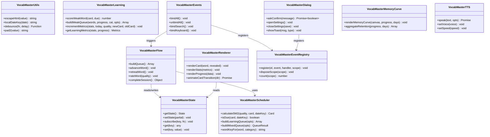
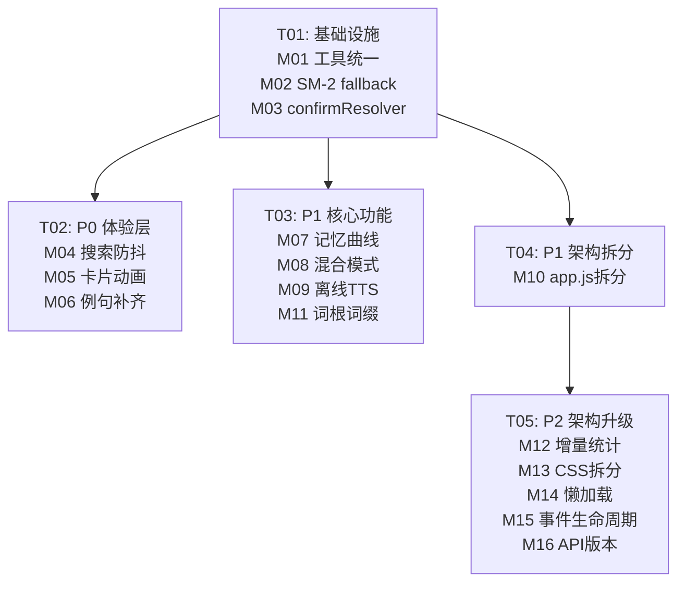

# VocabMaster v2.1~v2.2 完整技术实施方案 — 最终交付

> **SOP 流程**：产品经理（PRD）→ 架构师（实施方案）
> **基线版本**: v2.0.0 | **目标版本**: v2.1.0 / v2.2.0
> **日期**: 2026-07-18 | **技术栈**: Python 3 + pywebview + Vanilla JS + CSS3

---

## 目录

1. [审计摘要](#1-审计摘要)
2. [产品定义与用户故事](#2-产品定义与用户故事)
3. [需求池（P0/P1/P2）](#3-需求池p0p1p2)
4. [目标架构](#4-目标架构)
5. [16 模块详细技术方案](#5-16-模块详细技术方案)
6. [UI/UX 设计要点](#6-uiux-设计要点)
7. [任务分解与文件清单](#7-任务分解与文件清单)
8. [里程碑与发布计划](#8-里程碑与发布计划)
9. [跨模块共享知识](#9-跨模块共享知识)
10. [待确认问题](#10-待确认问题)

---

## 1. 审计摘要

### 1.1 总体评分

| 维度 | 产品评分 | 工程评分 | 综合 |
|------|:-------:|:-------:|:----:|
| 核心学习体验 | 5.5 | 7.0 | 6.3 |
| 内容质量 | 4.0 | 6.0 | **5.0** |
| 数据与反馈 | 6.0 | 7.5 | 6.8 |
| 交互与体验 | 6.5 | 6.5 | 6.5 |
| 平台与生态 | 4.0 | 8.0 | 6.0 |
| 工程质量 | — | 7.1 | 7.1 |
| **加权综合** | **5.5** | **7.1** | **6.3** |

### 1.2 对标竞品差距

| 竞品 | 产品力评分 | VocabMaster 差距 | 主要差距维度 |
|------|:---------:|:----------------:|-------------|
| 墨墨背单词 | 8.3 | -2.8 | 算法深度、记忆曲线、内容质量 |
| 不背单词 | 8.5 | -3.0 | UI 设计、原声例句、交互动画 |
| 百词斩 | 7.8 | -2.3 | 图片联想、游戏化、词库覆盖 |
| 扇贝单词 | 8.5 | -3.0 | 生态宽度、AI 驱动、社区 |
| Anki | 7.4 | -1.9 | 插件生态、全平台、可定制性 |

### 1.3 三个致命短板

| # | 短板 | 严重度 | 说明 |
|---|------|:------:|------|
| 1 | 例句质量 | ⚠️ 严重 | 大量词条显示"No example available in ECDICT."，与不背单词 150 万原声例句差距天壤 |
| 2 | 发音质量 | ⚠️ 严重 | 仅 Web Speech API 浏览器 TTS，音质不可控，无英音/美音切换 |
| 3 | 学习模式割裂 | ⚠️ 高 | 需手动切换新学/复习，而墨墨/扇贝的 AI 自动混合已是行业标准 |

### 1.4 三个核心竞争力

| # | 优势 | 独特度 | 说明 |
|---|------|:------:|------|
| 1 | 桌面深度集成 | ⭐⭐⭐ | 热键唤起 + 系统托盘 + Toast 提醒 + 开机启动，竞品中独一无二 |
| 2 | 数据安全体系 | ⭐⭐ | 原子写入 + 事务回滚 + 自动备份恢复，超越多数竞品 |
| 3 | 离线 + 开源 + 免费 | ⭐⭐ | 与全部需要联网/付费的竞品形成差异化定位 |

### 1.5 工程 TOP 5 问题

| # | 严重度 | 问题 | 位置 |
|---|:---:|------|------|
| 1 | 🔴 | SM-2 算法双实现不一致 | `app.js:142-185` vs `sm2-scheduler.js:35-59` |
| 2 | 🔴 | `confirmResolver` 全局单例竞态 | `app.js:1589` |
| 3 | 🔴 | 非事务性单文件写入 | `app.js:692-714` |
| 4 | 🟡 | `localDateKey`/`escapeHtml` 在 5-6 模块重复定义 | 6 个 JS 文件 |
| 5 | 🟡 | `app.js` 2848 行单体巨石 | `src/app.js` |

---

## 2. 产品定义与用户故事

### 2.1 三大产品目标

1. **体验止血（v2.1.0）**: 消除代码重复与竞态缺陷，降低用户感知的卡顿和闪烁，2 周内交付可感知的品质提升。
2. **功能升级（v2.1.0）**: 构建记忆曲线可视化、自动混合学习模式、高质量离线发音三大差异化能力。
3. **架构演进（v2.2.0）**: 完成前端模块化拆分、数据层性能优化、API 规范化，为后续多端扩展铺路。

### 2.2 16 条用户故事

| # | 阶段 | 用户故事 |
|---|:----:|---------|
| US-01 | P0 | 作为学习者，希望操作体验流畅无卡顿，不会因重复逻辑导致偶发 bug |
| US-02 | P0 | 依赖 SM-2 算法科学排课，不希望 app.js 中存在不完整的备用实现 |
| US-03 | P0 | 希望弹窗连续弹出时不会出现确认按钮失效问题 |
| US-04 | P0 | 搜索输入时不会每个字符都触发查询，避免页面抖动 |
| US-05 | P0 | 卡片切换时有平滑过渡，而不是生硬的闪现 |
| US-06 | P0 | 每个单词都能看到例句，而不是"暂无例句"占位提示 |
| US-07 | P1 | 希望看到自己的遗忘曲线，直观了解记忆衰退规律 |
| US-08 | P1 | 打开应用后自动进入混合学习模式，无需手动切换 |
| US-09 | P1 | 希望听到高质量发音，并能切换英音和美音 |
| US-10 | P1 | 希望能按职责定位代码，而非在 2800 行的 app.js 里找 |
| US-11 | P1 | 希望看到单词的词根词缀拆解，帮助理解和联想记忆 |
| US-12 | P2 | 统计面板打开时不需要等待全量计算 |
| US-13 | P2 | 希望能按组件定位样式，非在 2700 行 CSS 中查找 |
| US-14 | P2 | 大词库下应用首屏加载速度更快 |
| US-15 | P2 | 事件绑定/解绑有统一管理，不会内存泄漏 |
| US-16 | P2 | API 有明确的版本前缀，避免接口变更导致不可用 |

---

## 3. 需求池（P0/P1/P2）

### 3.1 P0 — 体验止血（v2.1.0-alpha，2 周）

#### P0-01：统一 `localDateKey` / `escapeHtml` 到 `core-utils.js`

| 维度 | 内容 |
|------|------|
| **当前问题** | `localDateKey` 在 `app.js` L8-11、`sm2-scheduler.js` L16-22、`learning-intelligence.js` L14-19、`stats-renderer.js` L51-56、`error-book.js` L23-29 各有一份。`escapeHtml` 在 `app.js` L7、`stats-renderer.js` L10-17、`error-book.js` L9-17、`search-utils.js` L10-17 各有一份 fallback。 |
| **目标** | `core-utils.js` 成为唯一权威来源，所有模块通过 `window.VocabMasterUtils` 引用 |
| **涉及文件** | `core-utils.js`（新增导出）、`app.js`、`sm2-scheduler.js`、`learning-intelligence.js`、`error-book.js`、`stats-renderer.js` |
| **验收标准** | `grep -rn "localDateKey\|escapeHtml" src/` 仅在 `core-utils.js` 有定义；所有 E2E 通过 |

#### P0-02：删除 `app.js` 中 SM-2 fallback 双实现

| 维度 | 内容 |
|------|------|
| **当前问题** | `app.js` L25-30 对 SM-2 函数提供 `= null` fallback，加载失败时静默降级 |
| **目标** | 若 `window.VocabMasterScheduler` 未加载则 `throw Error`，明确报错 |
| **涉及文件** | `src/app.js` |
| **验收标准** | 不存在 fallback 赋值；加载失败时明确报错 |

#### P0-03：修复 `confirmResolver` 全局单例竞态

| 维度 | 内容 |
|------|------|
| **当前问题** | 全局单例 `confirmResolver`，连续快速弹窗时新弹窗覆盖旧 resolver，旧 Promise 永不 resolve |
| **目标** | 改为队列化：同时只有一个活跃弹窗，后续请求排队；或栈式覆盖 + reject 旧 Promise |
| **涉及文件** | `src/app.js` |
| **验收标准** | 连续触发 3 次弹窗，每个都能正常响应 |

#### P0-04：搜索输入添加 200ms 防抖

| 维度 | 内容 |
|------|------|
| **当前问题** | 每个按键触发全词库过滤渲染，大词库下卡顿 |
| **目标** | `debounce(fn, 200)`，P95 < 100ms |
| **涉及文件** | `src/app.js` 搜索段 |
| **验收标准** | 快速输入 5 字符仅最后 1 次触发搜索 |

#### P0-05：添加单词卡片 CSS transition 过渡动画（0.2s）

| 维度 | 内容 |
|------|------|
| **当前问题** | 卡片切换时内容直接替换，无过渡效果 |
| **目标** | 前进右滑入（translateX 20px → 0），后退左滑入（-20px → 0），200ms ease-out，GPU 加速 |
| **涉及文件** | `src/styles.css`、`src/app.js` |
| **验收标准** | 前进/后退各有对应方向动画；动画不阻塞键盘事件；深色模式正常 |

#### P0-06：补充例句数据

| 维度 | 内容 |
|------|------|
| **当前问题** | ECDICT 部分词条无例句，显示占位说明"该词暂无例句" |
| **目标** | AI 生成 + 人工抽检，CET-4 ≥ 95%，CET-6 ≥ 90%，其他 ≥ 80% |
| **涉及文件** | `src/words/*.json`、`scripts/example_filler.py` |
| **验收标准** | 例句语法正确、语义通顺、中文翻译准确 |

### 3.2 P1 — 核心功能升级（v2.1.0-beta，4 周）

#### P1-07：记忆曲线可视化

| 维度 | 内容 |
|------|------|
| **目标** | 基于 SM-2 数据绘制个人 Ebbinghaus 曲线 vs 理想参考曲线，7/14/30 天切换 |
| **涉及文件** | 新建 `src/memory-curve.js`，修改 `stats-renderer.js`、`styles.css` |
| **验收标准** | Canvas 绑定，P95 < 50ms；深色模式适配 |

#### P1-08：学习模式自动混合

| 维度 | 内容 |
|------|------|
| **目标** | 新增"智能混合"为默认模式，自动优先复习 + 无缝衔接新学词，保留独立模式 |
| **涉及文件** | `sm2-scheduler.js`（新增 `buildMixedQueue`）、`app.js`、`styles.css` |
| **验收标准** | 首次打开即混合模式；进度条分段显示复习/新学数量 |

#### P1-09：发音升级 — 离线 TTS + 英/美音切换

| 维度 | 内容 |
|------|------|
| **目标** | Piper TTS 嵌入（~50MB），英音/美音切换，3 档语速，P95 < 500ms；Web Speech API 降级 |
| **涉及文件** | 新建 `tts.py`、`src/tts.js`，修改 `app.js`、`styles.css` |
| **验收标准** | 离线可发音；口音图标切换；语速可控 |

#### P1-10：`app.js` 按职责拆分 5 模块

| 维度 | 内容 |
|------|------|
| **目标** | 拆分为 `state-manager.js` / `learning-flow.js` / `renderer.js` / `dialog-manager.js` / `event-handlers.js`，`app.js` ≤ 200 行 |
| **涉及文件** | 新建 5 文件 + 重写 `app.js` + 修改 `index.html` script 顺序 |
| **验收标准** | 每模块 ≤ 600 行；模块间无循环依赖；E2E 全通过 |

#### P1-11：词根词缀解析

| 维度 | 内容 |
|------|------|
| **目标** | 规则引擎自动标注，≥ 60% 覆盖率，准确率 ≥ 85%；前缀(绿) + 词根(蓝) + 后缀(橙) 展示 |
| **涉及文件** | 新建 `scripts/annotate_morphology.py`，修改词库 JSON、`renderer.js`、`styles.css` |
| **验收标准** | 抽检 200 条准确率达标；不影响学习流程性能 |

### 3.3 P2 — 架构升级（v2.2.0，6-8 周）

#### P2-12：`getLearningMetrics()` 改为增量更新

| 维度 | 内容 |
|------|------|
| **目标** | 仅在学习行为后增量更新，统计面板 O(1) 读取，P95 < 50ms |
| **涉及文件** | `learning-intelligence.js`（重写）、`stats-renderer.js`（适配） |

#### P2-13：CSS 拆分为 6 组件文件

| 维度 | 内容 |
|------|------|
| **目标** | `base.css` / `card.css` / `stats.css` / `dialogs.css` / `search.css` / `dark-mode.css`，`@import` 聚合，单文件 ≤ 600 行 |
| **涉及文件** | 新建 6 CSS 文件 + 重写 `styles.css` + 修改 `index.html` |

#### P2-14：`get_all_words` 懒加载优化

| 维度 | 内容 |
|------|------|
| **目标** | 首次仅加载 100 词 + 元数据，分页 500 词；搜索改为后端模糊搜索；TTI ≤ 500ms |
| **涉及文件** | `app.py`（分页 API）、`app.js`（懒加载逻辑） |

#### P2-15：事件监听器生命周期管理

| 维度 | 内容 |
|------|------|
| **目标** | `EventRegistry` 提供 `register(el, event, handler, scope)` / `disposeScope(scope)`，模块 scope 化 |
| **涉及文件** | 新建 `src/event-registry.js`，修改所有事件绑定模块 |

#### P2-16：后端 API 版本号前缀

| 维度 | 内容 |
|------|------|
| **目标** | 所有 API 使用 `/v2/` 前缀，版本号来自 `VERSION` 文件 |
| **涉及文件** | `app.py`（API 注册）、`app.js`（Proxy 路径） |

---

## 4. 目标架构

### 4.1 当前架构（v2.0.0）

```
┌─────────────────────────────────────────────────────────┐
│                      index.html                         │
│  ┌──────────────────────────────────────────────────┐   │
│  │  script 标签按序加载（IIFE → window 命名空间）     │   │
│  │  core-utils.js → learning-intelligence.js →       │   │
│  │  sm2-scheduler.js → search-utils.js →             │   │
│  │  stats-renderer.js → settings-ui.js →             │   │
│  │  backup-actions.js → word-form.js →               │   │
│  │  error-book.js → keyboard-shortcuts.js →          │   │
│  │  app.js (2848行，全局状态 + 所有逻辑)               │   │
│  └──────────────────────────────────────────────────┘   │
│                    styles.css (2673行)                   │
├─────────────────────────────────────────────────────────┤
│              pywebview.api → app.py (Api class)          │
│              progress.json / stats.json / settings.json  │
└─────────────────────────────────────────────────────────┘
```

### 4.2 目标架构（v2.2.0）

```
┌─────────────────────────────────────────────────────────┐
│                      index.html                         │
│  ┌──────────────────────────────────────────────────┐   │
│  │  核心层: core-utils.js (统一工具)                  │   │
│  │  数据层: state-manager.js + learning-intelligence │   │
│  │  业务层: learning-flow.js + sm2-scheduler.js      │   │
│  │  渲染层: renderer.js + stats-renderer.js          │   │
│  │  UI层: dialog-manager.js + event-handlers.js      │   │
│  │  + event-registry.js + tts.js + memory-curve.js   │   │
│  │  入口: app.js (≤200行，编排)                       │   │
│  └──────────────────────────────────────────────────┘   │
│  base.css + card.css + stats.css + dialogs.css          │
│  + search.css + dark-mode.css (共6文件)                  │
├─────────────────────────────────────────────────────────┤
│           pywebview.api → app.py (/v2/ prefix)           │
│          + tts.py (Piper TTS 引擎)                       │
│          + Paginated APIs                                │
└─────────────────────────────────────────────────────────┘
```

### 4.3 类关系图



---

## 5. 16 模块详细技术方案

---

### M01 — 统一 `localDateKey` / `escapeHtml` 到 `core-utils.js`

**优先级**: P0 | **依赖**: 无 | **工期**: 0.5天 | **归属任务**: T01

#### 技术方案

将 5 个模块中的 `localDateKey` 重复定义和 4 个模块中的 `escapeHtml` fallback 统一到 `core-utils.js` 作为唯一权威来源。`core-utils.js` 同时新增 `debounce`（M04 使用）和 `pad2`（通用补零）导出。

#### 关键代码变更

**core-utils.js — 新增导出**:
```javascript
// src/core-utils.js — 在 return 语句中新增导出
return {
  escapeHtml,
  localDateKey,
  debounce,    // 新增
  pad2         // 新增
};

// 新增函数实现（插入在 escapeHtml 之后、return 之前）
function debounce(fn, delay = 200) {
  let timer = null;
  return function (...args) {
    clearTimeout(timer);
    timer = setTimeout(() => fn.apply(this, args), delay);
  };
}
```

**sm2-scheduler.js — 删除重复，改为引用**:
```javascript
// sm2-scheduler.js L12-22: 删除 pad2 和 localDateKey 定义，改为:
const { localDateKey, pad2 } = window.VocabMasterUtils;
```

**learning-intelligence.js — 删除重复**:
```javascript
// L10-19 删除 wordKeyFor 和 localDateKey 定义，改为:
const { wordKeyFor } = window.VocabMasterScheduler;
const { localDateKey } = window.VocabMasterUtils;
```

**error-book.js — 删除重复**:
```javascript
// L9-29 删除 _escapeHtml fallback 和 localDateKey 定义，改为:
const { escapeHtml, localDateKey } = window.VocabMasterUtils;
```

**stats-renderer.js — 删除重复**:
```javascript
// L10-17 和 L51-56 删除，改为:
const { escapeHtml, localDateKey } = window.VocabMasterUtils;
```

**app.js — 删除 fallback**:
```javascript
// L6-12 改为:
const { escapeHtml, localDateKey, debounce } = window.VocabMasterUtils || {};
```

#### 数据流与接口

```
window.VocabMasterUtils (core-utils.js)
├── escapeHtml(value: string): string
├── localDateKey(date?: Date): string  // "YYYY-MM-DD"
├── debounce(fn: Function, delay: number): Function
└── pad2(value: number): string
```

#### 风险评估

| 风险 | 概率 | 缓解措施 |
|------|:---:|---------|
| `window.VocabMasterUtils` 未加载 | 低 | `app.js` 初始化检查，undefined 则 alert 拒绝启动 |
| `sm2-scheduler.js` 加载早于 `core-utils.js` | 低 | `index.html` 已确保 `core-utils.js` 在最前 |
| `wordKeyFor` 从 scheduler 引用致循环 | 低 | `learning-intelligence.js` 不实现 wordKeyFor，只引用 |

#### 测试策略

- 单元测试: `core-utils.test.js` 增加 `debounce` 测试
- 验证脚本: `grep -rn "function localDateKey\|function escapeHtml" src/` 仅 `core-utils.js` 有定义
- E2E: Playwright 回归全部通过

---

### M02 — 删除 `app.js` 中 SM-2 fallback

**优先级**: P0 | **依赖**: M01 | **工期**: 0.25天 | **归属任务**: T01

#### 技术方案

`app.js` L25-30 对 `calculateSM2`、`isDue`、`buildLearningQueue`、`wordKeyFor` 提供 `= null` fallback。改为：若 `window.VocabMasterScheduler` 未加载则 `throw Error` 明确报错。

#### 关键代码变更

```javascript
// src/app.js L25-30 — 删除前:
const {
  calculateSM2 = null,
  isDue: schedulerIsDue = null,
  buildLearningQueue = null,
  wordKeyFor: schedulerWordKeyFor = null
} = window.VocabMasterScheduler || {};

// 改为:
const _scheduler = window.VocabMasterScheduler;
if (!_scheduler) {
  throw new Error('[VocabMaster] sm2-scheduler.js 未加载，请检查 index.html 脚本顺序');
}
const {
  calculateSM2,
  isDue: schedulerIsDue,
  buildLearningQueue,
  wordKeyFor: schedulerWordKeyFor
} = _scheduler;
```

同时搜索所有 `calculateSM2?.(` 和 `buildLearningQueue?.(` 调用，去掉 `?.` 改为直接调用。

#### 测试策略

- 单元测试: 模拟 `window.VocabMasterScheduler` 未定义，验证抛出明确错误
- E2E: 确保正常加载路径不受影响

---

### M03 — 修复 `confirmResolver` 竞态

**优先级**: P0 | **依赖**: 无 | **工期**: 0.5天 | **归属任务**: T01

#### 技术方案

当前 `confirmResolver` 为全局单例（`app.js` L1589），改为**队列化处理**：同时只有一个活跃弹窗，新弹窗覆盖旧弹窗并明确 reject 旧 Promise。

#### 关键代码变更

```javascript
// src/app.js ~L1589 — 新实现
const ConfirmQueue = {
  _pending: null,

  enqueue(message) {
    // 如有正在等待的弹窗，先 reject
    if (this._pending) {
      this._pending.reject(new Error('CONFIRM_SUPERSEDED'));
    }

    const overlay = $('#confirm-overlay');
    const msgEl = $('#confirm-message');
    msgEl.textContent = message;
    overlay.classList.remove('hidden');
    activateDialog(overlay, $('#btn-confirm-ok'));

    return new Promise((resolve, reject) => {
      this._pending = { resolve, reject };
    });
  },

  resolve(value = true) {
    if (this._pending) {
      this._pending.resolve(value);
      this._clear();
    }
  },

  reject(err = new Error('CONFIRM_CANCELLED')) {
    if (this._pending) {
      this._pending.reject(err);
      this._clear();
    }
  },

  _clear() {
    this._pending = null;
    const overlay = $('#confirm-overlay');
    overlay.classList.add('hidden');
    deactivateDialog(overlay);
  }
};

// 修改按钮事件绑定
$('#btn-confirm-ok').addEventListener('click', () => ConfirmQueue.resolve(true));
$('#btn-confirm-cancel').addEventListener('click', () => ConfirmQueue.reject());
```

#### 测试策略

- 集成测试: 连续快速触发 3 次确认弹窗，验证每个都能正常 resolve/reject
- 验证无悬挂 Promise

---

### M04 — 搜索输入 200ms 防抖

**优先级**: P0 | **依赖**: M01 | **工期**: 0.5天 | **归属任务**: T02

#### 技术方案

给搜索 `<input>` 的事件处理加上 `debounce(fn, 200)`，使用 M01 中 `core-utils.js` 导出的 `debounce` 函数。

#### 关键代码变更

```javascript
// src/app.js — 搜索事件处理（找到 search input 的 input/keyup 事件绑定处）
const searchInput = $('#word-search');

// 旧: searchInput.addEventListener('input', handleSearch);
// 新:
const debouncedSearch = debounce((event) => {
  const query = event.target.value.trim().toLowerCase();
  if (query.length === 0) {
    clearSearchResults();
    return;
  }
  const results = filterSearchWords(query, state.wordList);
  renderSearchResultsHtml(results, $('#search-results'));
}, 200);

searchInput.addEventListener('input', debouncedSearch);

// 注意：Enter 键提交搜索不使用防抖，立即触发
searchInput.addEventListener('keydown', (event) => {
  if (event.key === 'Enter') {
    debouncedSearch.flush?.();  // 如果有需要立即执行的搜索
  }
});
```

#### 测试策略

- 手动验证: 快速连续输入 5 字符，DevTools Performance 面板验证仅最后一次触发搜索
- 防抖延迟可通过常量配置

---

### M05 — 单词卡片 CSS transition 过渡动画（0.2s）

**优先级**: P0 | **依赖**: 无 | **工期**: 0.5天 | **归属任务**: T02

#### 技术方案

卡片切换时添加 `opacity` + `transform` CSS transition。前进方向（下一词）为从右滑入，后退方向（上一词）为从左滑入。使用双 `requestAnimationFrame` 技巧确保浏览器在两次 RAF 之间渲染初始状态。

#### 关键代码变更

**styles.css — 动画规则**:
```css
/* src/styles.css — 新增 */
.word-card {
  transition: opacity 0.2s ease-out, transform 0.2s ease-out;
  will-change: opacity, transform;
}

.word-card.slide-out-forward {
  opacity: 0;
  transform: translateX(-20px);
}

.word-card.slide-out-backward {
  opacity: 0;
  transform: translateX(20px);
}

.word-card.slide-in-forward {
  opacity: 0;
  transform: translateX(20px);
}

.word-card.slide-in-backward {
  opacity: 0;
  transform: translateX(-20px);
}
```

**app.js — 触发逻辑**:
```javascript
// src/app.js — 修改 renderCard 或 moveNext/movePrev 函数
function animateCardTransition(direction) {
  const card = $('#word-card');
  if (!card) return;

  const outClass = direction === 'forward'
    ? 'slide-out-forward'
    : 'slide-out-backward';
  const inClass = direction === 'forward'
    ? 'slide-in-forward'
    : 'slide-in-backward';

  return new Promise(resolve => {
    // 第一步: 设置出站初始状态
    card.classList.add(outClass);
    card.style.pointerEvents = 'none';

    // 第二步: 下一帧执行实际的出站动画
    requestAnimationFrame(() => {
      requestAnimationFrame(() => {
        card.classList.remove(outClass);
        // 出站完成，立即设为入站初始状态
        card.classList.add(inClass);

        // 更新内容（在动画间隙进行）
        renderCardContent();

        // 第三步: 触发入站动画
        requestAnimationFrame(() => {
          card.classList.remove(inClass);
          card.style.pointerEvents = '';

          card.addEventListener('transitionend', function handler() {
            card.removeEventListener('transitionend', handler);
            resolve();
          }, { once: true });
        });
      });
    });
  });
}
```

#### 测试策略

- 手动验证: 按 `→` 卡片右滑入，按 `←` 左滑入
- 动画不阻塞键盘: 200ms 内再次按键仍可响应
- 深色模式视觉检查

---

### M06 — 例句补齐

**优先级**: P0 | **依赖**: 无 | **工期**: 2天 | **归属任务**: T02

#### 技术方案

编写 `scripts/example_filler.py`，对 5 个词库中缺失例句的词条（`example === "No example available in ECDICT."`），通过 LLM 批量生成高质量例句和中文翻译。脚本支持 dry-run、备份、进度断点续传。

#### 关键代码变更

```python
# scripts/example_filler.py — 新文件
"""
批量补齐 ECDICT 词库中缺失的例句。

用法:
  python scripts/example_filler.py --category cet4 --dry-run   # 预览
  python scripts/example_filler.py --category cet4             # 实际生成
  python scripts/example_filler.py --all                       # 处理全部词库
"""

import json
import shutil
from pathlib import Path

WORD_DIR = Path("src/words")
BACKUP_DIR = Path("data/wordbank_backups")
CATEGORIES = ["cet4", "cet6", "postgraduate", "ielts", "toefl"]

MISSING_MARKERS = [
    "No example available in ECDICT.",
    "ECDICT 未提供例句。",
    ""
]

PROMPT_TEMPLATE = """为以下英语单词生成一个适合英语学习者的例句和中文翻译。
要求: 例句长度 8-15 词，贴近日常或学术场景，中文翻译准确自然。
单词: {word}
释义: {meaning}
请返回 JSON: {{"example": "...", "exampleTranslation": "..."}}"""

def load_wordbank(category):
    path = WORD_DIR / f"{category}.json"
    with open(path, "r", encoding="utf-8") as f:
        return json.load(f)

def save_wordbank(category, data):
    path = WORD_DIR / f"{category}.json"
    # 先备份
    BACKUP_DIR.mkdir(parents=True, exist_ok=True)
    backup_path = BACKUP_DIR / f"{category}.json.bak"
    shutil.copy2(path, backup_path)
    # 原子写入
    tmp_path = path.with_suffix(".tmp")
    with open(tmp_path, "w", encoding="utf-8") as f:
        json.dump(data, f, ensure_ascii=False, indent=2)
    tmp_path.replace(path)

def find_missing_examples(data):
    return [
        (i, word) for i, word in enumerate(data["words"])
        if (word.get("example") or "").strip() in MISSING_MARKERS
    ]

def generate_example(word_entry, dry_run=False):
    if dry_run:
        return {"example": f"[DRY-RUN] Example for {word_entry['word']}",
                "exampleTranslation": f"[DRY-RUN] {word_entry['word']}的中文翻译"}
    # TODO: 接入 LLM API（OpenAI-compatible）
    # 此处为占位实现，实际部署时替换为 LLM 调用
    raise NotImplementedError("需配置 LLM API endpoint")

def fill_category(category, dry_run=False):
    data = load_wordbank(category)
    missing = find_missing_examples(data)
    print(f"[{category}] 共 {len(missing)} 个词条缺例句")

    if dry_run:
        print(f"[DRY-RUN] 将生成 {len(missing)} 条例句")
        return

    filled = 0
    for idx, word in missing:
        try:
            example = generate_example(word, dry_run=False)
            data["words"][idx]["example"] = example["example"]
            data["words"][idx]["exampleTranslation"] = example["exampleTranslation"]
            filled += 1
            if filled % 50 == 0:
                print(f"  已生成 {filled}/{len(missing)} 条例句")
        except Exception as e:
            print(f"  [ERROR] {word['word']}: {e}")

    save_wordbank(category, data)
    print(f"[{category}] 完成: 生成 {filled} 条例句")
```

#### 测试策略

- dry-run 模式验证要处理的词条数量
- 生成后抽样 50 条人工检查语法和翻译
- 备份文件可恢复

---

### M07 — 记忆曲线可视化

**优先级**: P1 | **依赖**: M01 | **工期**: 2天 | **归属任务**: T03

#### 技术方案

新建 `src/memory-curve.js`，基于 SM-2 进度数据聚合计算记忆保持率，用 Canvas 绘制折线图。X 轴为时间（D1/D3/D7/D14/D30），Y 轴为保持率（0-100%）。理想 Ebbinghaus 标准曲线用虚线叠加对比。

#### 核心算法

```javascript
// src/memory-curve.js — 新文件

const EBBINGHAUS_CURVE = [
  { day: 0, retention: 100 },
  { day: 1, retention: 33.7 },
  { day: 2, retention: 27.8 },
  { day: 3, retention: 25.0 },
  { day: 7, retention: 21.1 },
  { day: 14, retention: 18.5 },
  { day: 30, retention: 17.0 }
];

(function (root, factory) {
  const api = factory();
  if (root) root.VocabMasterMemoryCurve = api;
})(typeof window !== 'undefined' ? window : globalThis, function () {

  /**
   * 从 progress 中聚合计算个人记忆保持率
   * @param {Object} progress — SM-2 进度数据
   * @param {number} days — 回溯天数
   * @returns {Array<{day: number, retention: number}>}
   */
  function aggregateRetention(progress, days = 30) {
    if (!progress || Object.keys(progress).length === 0) return [];

    const today = new Date();
    const buckets = {};

    // 统计各时间窗口的单词保持情况
    Object.values(progress).forEach(card => {
      if (!card || !card.nextReview) return;
      const reviewDate = new Date(card.nextReview);
      const diffDays = Math.round((reviewDate - today) / (1000 * 60 * 60 * 24));

      // EF >= 2.0 且 repetitions >= 3 视为"保持"
      const retained = card.ef >= 2.0 && card.repetitions >= 3;

      for (const keyDay of [1, 3, 7, 14, 30]) {
        if (!buckets[keyDay]) buckets[keyDay] = { total: 0, retained: 0 };
        if (diffDays <= keyDay) continue;
        buckets[keyDay].total++;
        if (retained) buckets[keyDay].retained++;
      }
    });

    // 转换为数组并按日排序
    return Object.entries(buckets)
      .map(([day, { total, retained }]) => ({
        day: Number(day),
        retention: total > 0 ? Math.round((retained / total) * 100) : null
      }))
      .filter(p => p.retention !== null)
      .sort((a, b) => a.day - b.day);
  }

  /**
   * 在 Canvas 上绘制记忆曲线
   * @param {HTMLCanvasElement} canvas
   * @param {Object} progress
   * @param {number} days — 7/14/30
   */
  function renderMemoryCurve(canvas, progress, days = 14) {
    const ctx = canvas.getContext('2d');
    const isDark = document.body.getAttribute('data-theme') === 'dark';

    // 颜色配置
    const bgColor = isDark ? '#1a1a2e' : '#ffffff';
    const personalColor = '#2f6f73';
    const idealColor = isDark ? 'rgba(47,111,115,0.4)' : 'rgba(47,111,115,0.3)';
    const textColor = isDark ? '#94a3b8' : '#64748b';
    const gridColor = isDark ? 'rgba(148,163,184,0.15)' : 'rgba(100,116,139,0.15)';

    const dpr = window.devicePixelRatio || 1;
    const width = canvas.clientWidth;
    const height = canvas.clientHeight;
    canvas.width = width * dpr;
    canvas.height = height * dpr;
    ctx.scale(dpr, dpr);

    // 背景
    ctx.fillStyle = bgColor;
    ctx.fillRect(0, 0, width, height);

    const padding = { top: 20, right: 20, bottom: 40, left: 50 };
    const chartW = width - padding.left - padding.right;
    const chartH = height - padding.top - padding.bottom;

    // 获取数据
    const personal = aggregateRetention(progress, days);

    // 绘制网格和 Y 轴标签
    ctx.fillStyle = textColor;
    ctx.font = '11px system-ui';
    ctx.textAlign = 'right';
    for (let y = 0; y <= 100; y += 20) {
      const py = padding.top + chartH - (y / 100) * chartH;
      ctx.fillText(`${y}%`, padding.left - 8, py + 4);

      ctx.strokeStyle = gridColor;
      ctx.beginPath();
      ctx.moveTo(padding.left, py);
      ctx.lineTo(padding.left + chartW, py);
      ctx.stroke();
    }

    // 绘制 X 轴标签（使用个人数据的实际天数）
    const displayDays = personal.length > 0
      ? personal.map(p => p.day)
      : [1, 3, 7, 14, 30].filter(d => d <= days);

    ctx.textAlign = 'center';
    displayDays.forEach(day => {
      const x = padding.left + (day / days) * chartW;
      ctx.fillText(`D${day}`, x, height - 8);
    });

    // 绘制理想 Ebbinghaus 曲线（虚线）
    ctx.strokeStyle = idealColor;
    ctx.lineWidth = 1.5;
    ctx.setLineDash([6, 4]);
    ctx.beginPath();
    EBBINGHAUS_CURVE.filter(p => p.day <= days).forEach((point, i) => {
      const x = padding.left + (point.day / days) * chartW;
      const y = padding.top + chartH - (point.retention / 100) * chartH;
      if (i === 0) ctx.moveTo(x, y);
      else ctx.lineTo(x, y);
    });
    ctx.stroke();
    ctx.setLineDash([]);

    // 绘制个人曲线（实线 + 数据点）
    if (personal.length > 0) {
      ctx.strokeStyle = personalColor;
      ctx.lineWidth = 2;
      ctx.beginPath();
      personal.forEach((point, i) => {
        const x = padding.left + (point.day / days) * chartW;
        const y = padding.top + chartH - (point.retention / 100) * chartH;
        if (i === 0) ctx.moveTo(x, y);
        else ctx.lineTo(x, y);
      });
      ctx.stroke();

      // 数据点
      personal.forEach(point => {
        const x = padding.left + (point.day / days) * chartW;
        const y = padding.top + chartH - (point.retention / 100) * chartH;
        ctx.fillStyle = personalColor;
        ctx.beginPath();
        ctx.arc(x, y, 4, 0, Math.PI * 2);
        ctx.fill();

        // 数值标签
        ctx.fillStyle = textColor;
        ctx.textAlign = 'center';
        ctx.fillText(`${point.retention}%`, x, y - 10);
      });
    }
  }

  return { aggregateRetention, renderMemoryCurve };
});
```

#### 测试策略

- 单元测试: 聚合函数输入模拟 progress 数据，验证保持率计算正确
- 手动测试: Canvas 绘制后截图与设计稿对比
- 边界: 空 progress、极端 EF 值、全部新词（无复习数据）

---

### M08 — 学习模式自动混合

**优先级**: P1 | **依赖**: M01, M02, M05 | **工期**: 3天 | **归属任务**: T03

#### 技术方案

新增 `mixed` 作为默认学习模式。在 `sm2-scheduler.js` 中新增 `buildMixedQueue()`，优先级策略：到期复习词 → 逾期复习词 → 新学词补足日目标。前端模式 Tab 新增"混合"选项，进度条分段显示复习/新学计数。

#### 关键代码变更

**sm2-scheduler.js — 新增 buildMixedQueue**:
```javascript
// src/sm2-scheduler.js — 在 return 前新增

function buildMixedQueue({
  words, progress, category, settings, today, favorites, shuffleFn
}) {
  const dateKey = today || localDateKey();
  const dailyGoal = (settings && settings.dailyGoal) || 30;

  // Phase 1: 获取所有到期复习词
  const reviewWords = buildDueWords(words, progress, category, dateKey);

  // Phase 2: 计算还需多少新词
  const remainingSlots = Math.max(0, dailyGoal - reviewWords.length);

  // Phase 3: 获取新学候选词
  let newCandidateWords;
  if (remainingSlots > 0) {
    const newWords = words.filter(word => {
      const card = progress[wordKeyFor(word, category)];
      return !card || card.repetitions === 0;
    });
    newCandidateWords = (shuffleFn || defaultShuffle)(newWords).slice(0, remainingSlots);
  } else {
    newCandidateWords = [];
  }

  // Phase 4: 交叉排列（复习词优先）
  // 每 3 个复习词后插入 1 个新词，避免连续学太多新词
  const mixed = [];
  let reviewIdx = 0, newIdx = 0;
  while (reviewIdx < reviewWords.length || newIdx < newCandidateWords.length) {
    for (let i = 0; i < 3 && reviewIdx < reviewWords.length; i++) {
      mixed.push(reviewWords[reviewIdx++]);
    }
    if (newIdx < newCandidateWords.length) {
      mixed.push(newCandidateWords[newIdx++]);
    }
  }

  return {
    queue: mixed,
    reviewCount: reviewWords.length,
    newCount: newCandidateWords.length,
    total: mixed.length
  };
}
```

**app.js — 新增 mixed 模式入口**:
```javascript
// src/app.js — 在 mode 相关代码中新增 'mixed' 支持
const MODES = ['mixed', 'review', 'new', 'weak', 'test'];
const MODE_LABELS = {
  mixed: '混合',
  review: '复习',
  new: '新学',
  weak: '强化',
  test: '测试'
};
```

**styles.css — 进度条分段**:
```css
/* 混合模式进度条分段显示 */
.progress-bar.mixed {
  display: flex;
  gap: 2px;
}
.progress-segment-review { background: var(--color-accent); }
.progress-segment-new { background: var(--color-warm); }
```

#### 数据流

```
用户选择混合模式 → app.js 调用 sm2-scheduler.buildMixedQueue()
  → 返回 { queue, reviewCount, newCount }
  → renderer 更新分段进度条
  → 学习流程按 queue 顺序展示
  → 评级后 SM-2 正常更新 progress
  → 统计面板区分复习/新学贡献
```

#### 测试策略

- 单元测试: `buildMixedQueue` 各种场景（纯复习/纯新词/混合）
- E2E: 首次打开 → 默认混合模式 → 完成复习后自动进入新学
- 进度条分段正确性验证

---

### M09 — 离线 TTS 发音升级

**优先级**: P1 | **依赖**: 无 | **工期**: 3天 | **归属任务**: T03

#### 技术方案

Piper TTS 作为主引擎（高品质离线，~50MB 模型），Web Speech API 降级。后端 `tts.py` 通过 subprocess 管理 Piper 进程，前端 `src/tts.js` 封装播放逻辑。支持英音/美音切换和 3 档语速。

#### 关键代码变更

**tts.py — 后端 TTS 引擎管理**:
```python
# tts.py — 新文件

import subprocess
import tempfile
import os
from pathlib import Path

PIPER_MODELS = {
    'en-US': 'en_US-lessac-medium.onnx',
    'en-GB': 'en_GB-alba-medium.onnx'
}

MODEL_DIR = Path(__file__).parent / 'data' / 'piper_models'

class TTSEngine:
    def __init__(self):
        self._voice = 'en-US'
        self._speed = 1.0
        self._piper_available = self._check_piper()

    def _check_piper(self):
        try:
            subprocess.run(['piper', '--help'], capture_output=True, timeout=5)
            return True
        except (FileNotFoundError, subprocess.TimeoutExpired):
            return False

    def set_voice(self, voice):
        if voice in PIPER_MODELS:
            self._voice = voice

    def set_speed(self, speed):
        self._speed = max(0.5, min(2.0, float(speed)))

    def speak(self, text):
        if not self._piper_available:
            return {'success': False, 'fallback': 'web-speech',
                    'message': 'Piper TTS 不可用，请使用 Web Speech API'}

        model_path = MODEL_DIR / PIPER_MODELS[self._voice]
        if not model_path.exists():
            return {'success': False, 'fallback': 'web-speech',
                    'message': f'语音模型未找到: {PIPER_MODELS[self._voice]}'}

        try:
            with tempfile.NamedTemporaryFile(suffix='.wav', delete=False) as f:
                output_path = f.name

            # Piper TTS 调用
            cmd = [
                'piper',
                '--model', str(model_path),
                '--output_file', output_path,
                '--length_scale', str(self._speed)
            ]
            process = subprocess.run(
                cmd,
                input=text.encode('utf-8'),
                capture_output=True,
                timeout=10
            )

            if process.returncode != 0:
                return {'success': False, 'error': process.stderr.decode()}

            # 读取音频数据
            with open(output_path, 'rb') as f:
                audio_data = f.read()

            os.unlink(output_path)

            return {
                'success': True,
                'audio': audio_data.hex(),  # 转为 hex 传输
                'format': 'wav'
            }

        except Exception as e:
            return {'success': False, 'fallback': 'web-speech', 'error': str(e)}
```

**src/tts.js — 前端 TTS 封装**:
```javascript
// src/tts.js — 新文件

const VocabMasterTTS = (function () {
  let currentVoice = 'en-US';
  let currentSpeed = 1.0;

  async function speak(text) {
    try {
      // 优先使用 Piper TTS
      const result = await api.tts_speak(text, currentVoice, currentSpeed);
      if (result.success) {
        // 将 hex 音频数据转回 ArrayBuffer 并播放
        const bytes = new Uint8Array(result.audio.match(/.{1,2}/g)
          .map(b => parseInt(b, 16)));
        await playAudioBytes(bytes);
        return;
      }
    } catch (e) {
      console.warn('Piper TTS 失败，降级到 Web Speech API:', e);
    }

    // 降级: Web Speech API
    const utterance = new SpeechSynthesisUtterance(text);
    utterance.lang = currentVoice;
    utterance.rate = currentSpeed;
    window.speechSynthesis.speak(utterance);
  }

  async function playAudioBytes(bytes) {
    const audioCtx = new (window.AudioContext || window.webkitAudioContext)();
    const audioBuffer = await audioCtx.decodeAudioData(bytes.buffer);
    const source = audioCtx.createBufferSource();
    source.buffer = audioBuffer;
    source.connect(audioCtx.destination);
    source.start();
    return new Promise(resolve => {
      source.onended = () => {
        audioCtx.close();
        resolve();
      };
    });
  }

  function setVoice(voice) { currentVoice = voice; }
  function setSpeed(speed) { currentSpeed = speed; }
  function getVoice() { return currentVoice; }

  return { speak, setVoice, setSpeed, getVoice };
})();
```

#### 测试策略

- 单元测试: TTS 引擎 mock 测试
- 集成测试: 英音/美音切换发音正确性
- 性能: 发音延迟 P95 < 500ms
- 降级: 确认 Piper 不可用时 Web Speech API 正常

---

### M10 — `app.js` 按职责拆分 5 模块

**优先级**: P1 | **依赖**: M01, M02, M03 | **工期**: 6天 | **归属任务**: T04

#### 拆分方案与公共 API

| 模块 | 文件 | 命名空间 | 预计行数 | 职责 |
|------|------|---------|:------:|------|
| **状态管理** | `src/state-manager.js` | `VocabMasterState` | ~200 | 全局 state 的读写、订阅、metrics 缓存 |
| **学习流程** | `src/learning-flow.js` | `VocabMasterFlow` | ~400 | buildQueue / advanceWord / retreatWord / rateWord / completeSession |
| **DOM 渲染** | `src/renderer.js` | `VocabMasterRenderer` | ~550 | renderCard / renderStats / renderProgress / animateCardTransition |
| **弹窗管理** | `src/dialog-manager.js` | `VocabMasterDialog` | ~350 | ConfirmQueue / openSettings / showToast / activateDialog |
| **事件处理** | `src/event-handlers.js` | `VocabMasterEvents` | ~300 | bindAll / unbindAll / bindSearch / bindKeyboard |
| **入口** | `src/app.js` | — | ≤200 | 模块编排 + 初始化 |

#### 各模块公共 API

**state-manager.js**:
```javascript
window.VocabMasterState = {
  get(key)           // 读取: VocabMasterState.get('category')
  set(key, value)    // 写入: VocabMasterState.set('category', 'ielts')
  getState()         // 获取完整 state 快照
  setState(partial)  // 部分更新
  subscribe(key, fn) // 订阅变更: VocabMasterState.subscribe('category', (v) => {...})
};
```

**learning-flow.js**:
```javascript
window.VocabMasterFlow = {
  buildQueue()       // 构建学习队列
  advanceWord()      // 向前换词 → renderCard
  retreatWord()      // 向后换词 → renderCard
  rateWord(quality)  // 评级 1/3/5 → SM-2 → 保存 → advanceWord
  completeSession()  // 完成一轮 → 统计 → complete overlay
};
```

**renderer.js**:
```javascript
window.VocabMasterRenderer = {
  renderCard(word, revealed)  // 渲染单词卡片
  renderStats(metrics)        // 渲染统计面板
  renderProgress(data)        // 渲染进度条
  animateCardTransition(dir)  // 执行卡片过渡动画
  showToast(msg, type)        // 显示 Toast
};
```

**dialog-manager.js**:
```javascript
window.VocabMasterDialog = {
  askConfirm(message)      // → Promise<boolean>
  openSettingsModal(data)  // 打开设置面板
  closeSettingsModal(save) // 关闭并保存/放弃
  showOverlay(id)          // 显示通用弹窗
  hideOverlay(id)          // 隐藏通用弹窗
};
```

**event-handlers.js**:
```javascript
window.VocabMasterEvents = {
  bindAll()    // 绑定全部事件
  unbindAll()  // 解绑全部事件
};
```

#### index.html script 加载顺序

```html
<!-- src/index.html — 按依赖顺序 -->
<script src="core-utils.js"></script>
<script src="event-registry.js"></script>
<script src="sm2-scheduler.js"></script>
<script src="learning-intelligence.js"></script>
<script src="search-utils.js"></script>

<!-- M10 新增 5 个模块 -->
<script src="state-manager.js"></script>
<script src="learning-flow.js"></script>
<script src="renderer.js"></script>
<script src="dialog-manager.js"></script>
<script src="event-handlers.js"></script>

<!-- 功能模块 -->
<script src="tts.js"></script>
<script src="memory-curve.js"></script>
<script src="stats-renderer.js"></script>
<script src="settings-ui.js"></script>
<script src="backup-actions.js"></script>
<script src="word-form.js"></script>
<script src="error-book.js"></script>
<script src="keyboard-shortcuts.js"></script>

<!-- 入口 -->
<script src="app.js"></script>
```

#### 风险评估

| 风险 | 缓解措施 |
|------|---------|
| 拆分引入回归 bug | 每拆一个模块后立即运行全量 E2E 测试 |
| 循环依赖 | 通过依赖图验证：Flow → State → Scheduler 单向 |
| 命名空间冲突 | 拆分前 grep 确认 window.xxx 未被占用 |

---

### M11 — 词根词缀标注

**优先级**: P1 | **依赖**: M06, M10 | **工期**: 2天 | **归属任务**: T03

#### 技术方案

编写规则引擎脚本 `scripts/annotate_morphology.py`，利用常见前缀/词根/后缀词典对词库进行自动标注。标注结果存储在词库 JSON 的 `morphology` 字段。前端在单词卡片上用颜色编码展示（前缀绿 + 词根蓝 + 后缀橙）。

#### 规则引擎实现

```python
# scripts/annotate_morphology.py — 新文件

PREFIXES = {
    'un-': '否定', 're-': '再次', 'pre-': '之前', 'dis-': '否定/相反',
    'mis-': '错误', 'over-': '过度', 'under-': '不足', 'sub-': '下面',
    'inter-': '之间', 'trans-': '跨越', 'super-': '超级', 'semi-': '半',
    'anti-': '反对', 'mid-': '中间', 'non-': '非', 'in-': '否定',
    'im-': '否定', 'ir-': '否定', 'il-': '否定', 'en-': '使',
    'ex-': '向外/前任', 'extra-': '额外', 'micro-': '微', 'macro-': '宏',
    'multi-': '多', 'out-': '超越', 'post-': '之后', 'pro-': '支持/向前',
    'co-': '共同', 'de-': '去除/向下', 'bi-': '双', 'tri-': '三',
}

SUFFIXES = {
    '-able': '能…的', '-ible': '能…的', '-al': '…的',
    '-ful': '充满…的', '-less': '无…的', '-ous': '…的',
    '-ive': '有…倾向的', '-ly': '…地', '-ness': '…的性质',
    '-ment': '…的行为/结果', '-tion': '…的行为/状态', '-sion': '…的行为',
    '-er': '…的人/物', '-or': '…的人/物', '-ist': '…者',
    '-ism': '…主义', '-ity': '…的性质', '-ence': '…的状态',
    '-ance': '…的状态', '-ure': '…的过程', '-age': '…的状态',
    '-ship': '…的关系/状态', '-dom': '…的领域/状态',
    '-en': '使…', '-ify': '使…', '-ize': '使…',
    '-ward': '向…方向', '-wise': '在…方面',
}

ROOTS = {
    'spect': '看', 'dict': '说', 'ject': '投/抛', 'port': '携带',
    'rupt': '打破', 'scrib': '写', 'script': '写', 'struct': '建造',
    'tract': '拉', 'ven': '来', 'vert': '转', 'voc': '声音/呼唤',
    'aud': '听', 'bene': '好', 'cred': '相信', 'duc': '引导',
    'fac': '做', 'fer': '携带', 'fin': '结束', 'gen': '产生',
    'grad': '步/级', 'graph': '写/画', 'hydr': '水', 'jur': '法律',
    'log': '言语/科学', 'mand': '命令', 'manu': '手', 'migr': '迁移',
    'miss': '发送', 'mit': '发送', 'mob': '移动', 'mort': '死亡',
    'nat': '出生', 'nov': '新', 'path': '感受', 'ped': '脚',
    'pend': '悬挂', 'phon': '声音', 'poli': '城市', 'pos': '放置',
    'prim': '第一', 'psych': '心理', 'quer': '询问', 'sci': '知道',
    'sens': '感觉', 'sequ': '跟随', 'serv': '服务/保存', 'sign': '标记',
    'simil': '相似', 'sol': '单独/太阳', 'son': '声音', 'spir': '呼吸',
    'tang': '接触', 'temp': '时间', 'ten': '持有', 'terr': '土地',
    'therm': '热', 'vac': '空', 'val': '价值', 'vid': '看',
    'vis': '看', 'vit': '生命', 'viv': '生活', 'vol': '意愿/卷',
}

def annotate_word(word):
    """对单个单词进行词根词缀标注。返回 morphology 对象或 None。"""
    lowered = word.lower()
    result = []

    # Phase 1: 前缀匹配（优先匹配更长的前缀）
    matched_prefixes = sorted(
        [(p, m) for p, m in PREFIXES.items() if lowered.startswith(p)],
        key=lambda x: len(x[0]), reverse=True
    )
    if matched_prefixes:
        prefix, meaning = matched_prefixes[0]
        result.append({'type': 'prefix', 'text': prefix, 'meaning': meaning})
        lowered = lowered[len(prefix):]

    # Phase 2: 后缀匹配
    matched_suffixes = sorted(
        [(s, m) for s, m in SUFFIXES.items() if lowered.endswith(s)],
        key=lambda x: len(x[0]), reverse=True
    )
    suffix_info = None
    if matched_suffixes:
        suffix, meaning = matched_suffixes[0]
        suffix_info = {'type': 'suffix', 'text': suffix, 'meaning': meaning}
        lowered = lowered[:-len(suffix)]

    # Phase 3: 词根匹配（在剩余部分中搜索）
    root_info = None
    for root, meaning in sorted(ROOTS.items(), key=lambda x: len(x[0]), reverse=True):
        if root in lowered:
            before, after = lowered.split(root, 1)
            root_info = {'type': 'root', 'text': root, 'meaning': meaning}
            if before:
                result.append({'type': 'connector', 'text': before, 'meaning': ''})
            result.append(root_info)
            if after:
                result.append({'type': 'connector', 'text': after, 'meaning': ''})
            break

    if suffix_info:
        result.append(suffix_info)

    # 至少识别出一个有效组件
    effective = [r for r in result if r['type'] in ('prefix', 'root', 'suffix')]
    if len(effective) == 0:
        return None

    return result
```

#### 前端展示

```css
/* src/styles.css — 词根词缀样式 */
.morph-prefix  { color: #2ecc71; }    /* 绿色: 前缀 */
.morph-root    { color: #3498db; }    /* 蓝色: 词根 */
.morph-suffix  { color: #e67e22; }    /* 橙色: 后缀 */
.morph-meaning { font-size: 0.8em; color: var(--text-muted); }
```

#### 测试策略

- 脚本测试: 已知单词验证标注正确性（如 `unbelievable → un- + believe + -able`）
- 人工抽检 200 条验证准确率 ≥ 85%
- 覆盖率统计: CET-4/CET-6 ≥ 60% 有标注

---

### M12 — `getLearningMetrics()` 增量更新

**优先级**: P2 | **依赖**: M01, M10 | **工期**: 2天 | **归属任务**: T05

#### 技术方案

`learning-intelligence.js` 新增 `incrementMetrics()` 函数，在每次学习行为（rateWord）后增量更新 stats 指标。`state-manager.js` 维护 `_metricsCache`，统计面板直接读取缓存，P95 < 50ms。

```javascript
// src/learning-intelligence.js — 新增增量更新函数

function incrementMetrics(stats, today, quality, wordKey, newCard, oldCard) {
  const daily = stats.daily[today] || { studied: 0, correct: 0, total: 0 };

  // 只有新增学习行为时才更新
  daily.studied = (daily.studied || 0) + 1;
  daily.total = (daily.total || 0) + 1;
  if (quality >= 3) {
    daily.correct = (daily.correct || 0) + 1;
  }

  stats.daily[today] = daily;
  stats.lastStudyDate = today;

  // 增量更新记忆持久度缓存
  if (!stats._persistenceCache) stats._persistenceCache = {};
  stats._persistenceCache[wordKey] = {
    ef: newCard.ef,
    repetitions: newCard.repetitions,
    lapses: newCard.lapses || 0,
    lastQuality: quality
  };

  // 标记缓存脏
  stats._metricsDirty = true;

  return stats;
}

function getLearningMetrics(stats, words, progress, category) {
  if (!stats._metricsDirty && stats._cachedMetrics) {
    return stats._cachedMetrics;
  }

  // 全量重算（仅缓存脏时触发）
  const today = localDateKey();
  const metrics = {
    totalStudied: Object.values(stats.daily || {}).reduce((s, d) => s + (d.studied || 0), 0),
    mastered: Object.values(progress || {}).filter(c => c.repetitions >= 3 && c.ef >= 2.0).length,
    streak: stats.streak || 0,
    todayStudied: (stats.daily[today] || {}).studied || 0,
    todayAccuracy: computeAccuracy(stats.daily[today]),
    dueToday: computeDueCount(words, progress, category, today),
    dueTomorrow: computeDueCount(words, progress, category, tomorrowKey())
  };

  stats._cachedMetrics = metrics;
  stats._metricsDirty = false;

  return metrics;
}
```

#### 测试策略

- 单元测试: `incrementMetrics` 增量结果 vs `createLearningReport` 全量结果对比一致
- 性能测试: 6974 词库统计面板打开 P95 < 50ms

---

### M13 — CSS 拆分为 6 组件文件

**优先级**: P2 | **依赖**: M10 | **工期**: 1.5天 | **归属任务**: T05

#### 拆分方案

| 文件 | 内容 | 预计行数 |
|------|------|:------:|
| `src/css/base.css` | CSS 变量 (`:root` / `[data-theme="dark"]`)、Reset、Typography、Layout | ~350 |
| `src/css/card.css` | 单词卡片、进度条、评级按钮、收藏按钮、记忆细节面板 | ~450 |
| `src/css/stats.css` | 统计面板、热力图、趋势图、词库进度、复习预测、历史 | ~400 |
| `src/css/dialogs.css` | 弹窗通用、设置面板、确认弹窗、热键编辑、单词添加、关于 | ~550 |
| `src/css/search.css` | 搜索输入、搜索结果下拉、Category Tabs、模式 Tabs | ~200 |
| `src/css/dark-mode.css` | `.dark` / `[data-theme="dark"]` 覆盖规则（专注深色模式） | ~300 |

#### 聚合方式

```css
/* src/styles.css — 改为 @import 聚合 */
@import 'css/base.css';
@import 'css/card.css';
@import 'css/stats.css';
@import 'css/dialogs.css';
@import 'css/search.css';
@import 'css/dark-mode.css';
```

```html
<!-- src/index.html — 修改 link -->
<link rel="stylesheet" href="styles.css">
<!-- 其余不变，styles.css 通过 @import 加载子文件 -->
```

---

### M14 — `get_all_words` 懒加载优化

**优先级**: P2 | **依赖**: M10, M16 | **工期**: 3天 | **归属任务**: T05

#### 新增后端 API

```python
# app.py — 新增分页和搜索 API

class Api:
    # 现有 get_word_list(category) 保持不变，返回完整词表

    def get_word_page(self, category, page=1, per_page=100):
        """分页获取词表，减少首次加载数据量。"""
        words = self.get_word_list(category)
        start = (page - 1) * per_page
        end = start + per_page
        return {
            'words': words[start:end],
            'total': len(words),
            'page': page,
            'per_page': per_page,
            'has_more': end < len(words)
        }

    def search_words(self, query, category=None, limit=20):
        """后端模糊搜索，前端不再持有全量数据。"""
        all_words = []
        cats = [category] if category and category != 'all' else None
        words_data = self.get_all_words(cats)  # 可按需加载
        for cat, words in words_data.items():
            for word in words:
                if query.lower() in word.get('word', '').lower() or \
                   query in word.get('meaning', ''):
                    word['_cat'] = cat
                    all_words.append(word)
        return all_words[:limit]

    def get_wordbank_meta(self):
        """获取词库元数据，不加载完整词表。"""
        return {
            'cet4': {'total': 3849, 'name': 'CET-4'},
            'cet6': {'total': 5407, 'name': 'CET-6'},
            'postgraduate': {'total': 4801, 'name': '考研'},
            'ielts': {'total': 5040, 'name': 'IELTS'},
            'toefl': {'total': 6974, 'name': 'TOEFL'},
        }
```

#### 前端懒加载逻辑

```javascript
// src/app.js — 修改 loadWordList
async function loadWordList(category) {
  if (wordListCache.has(category)) {
    state.wordList = wordListCache.get(category);
    return;
  }

  // Phase 1: 先加载前 100 词 + 元数据（快速首屏）
  const meta = await api.get_wordbank_meta();
  const firstPage = await api.get_word_page(category, 1, 100);

  state.wordList = firstPage.words;
  state.wordListMeta = meta[category];
  wordListCache.set(category, firstPage.words);

  renderCard(); // 首屏立即可交互

  // Phase 2: 后台继续加载剩余（不阻塞用户）
  loadRemainingPages(category, firstPage.total, firstPage.per_page);
}

async function loadRemainingPages(category, total, perPage) {
  const totalPages = Math.ceil(total / perPage);
  for (let page = 2; page <= totalPages; page++) {
    const page = await api.get_word_page(category, page, perPage);
    const cached = wordListCache.get(category) || [];
    cached.push(...page.words);
    wordListCache.set(category, cached);
    state.wordList = cached;
    markMetricsDirty();
  }
}
```

#### 测试策略

- 性能: TTI ≤ 500ms（TOEFL 6974 词）
- 功能: 学习队列不受分页影响（在首屏 100 词内即可开始学习）
- 搜索: 改为后端 API，不依赖前端全量数据

---

### M15 — 事件监听器生命周期管理

**优先级**: P2 | **依赖**: M10 | **工期**: 1天 | **归属任务**: T05

#### 技术方案

```javascript
// src/event-registry.js — 新文件

(function (root, factory) {
  const api = factory();
  if (root) root.VocabMasterEventRegistry = api;
})(typeof window !== 'undefined' ? window : globalThis, function () {

  const registry = new Map(); // scope → [{element, event, handler}]

  function register(element, event, handler, scope = 'global') {
    if (!element || !event || !handler) return;

    if (!registry.has(scope)) {
      registry.set(scope, []);
    }

    const list = registry.get(scope);
    list.push({ element, event, handler });

    element.addEventListener(event, handler);
  }

  function disposeScope(scope) {
    const list = registry.get(scope);
    if (!list) return;

    list.forEach(({ element, event, handler }) => {
      element.removeEventListener(event, handler);
    });

    registry.delete(scope);
  }

  function count(scope = null) {
    if (scope) {
      return registry.has(scope) ? registry.get(scope).length : 0;
    }
    let total = 0;
    registry.forEach(list => { total += list.length; });
    return total;
  }

  function dump() {
    const result = {};
    registry.forEach((list, scope) => {
      result[scope] = list.map(e => `${e.event} → ${e.handler.name || 'anon'}`);
    });
    return result;
  }

  return { register, disposeScope, count, dump };
});
```

#### 使用示例

```javascript
// dialog-manager.js 中使用
const SCOPE = 'dialog-manager';

function openSettingsModal() {
  const EventReg = window.VocabMasterEventRegistry;

  EventReg.register($('#btn-save'), 'click', handleSave, SCOPE);
  EventReg.register($('#btn-cancel'), 'click', handleCancel, SCOPE);
  EventReg.register(document, 'keydown', handleEscape, SCOPE);
}

function closeSettingsModal() {
  window.VocabMasterEventRegistry.disposeScope(SCOPE);
}
```

#### 测试策略

- Chrome DevTools: 切换模式 10 次后检查 `getEventListeners()` 数量不增长
- 单元测试: `register` + `disposeScope` 验证元素上的监听器确实被移除

---

### M16 — API 版本号前缀

**优先级**: P2 | **依赖**: 无 | **工期**: 1天 | **归属任务**: T05

#### 技术方案

所有 API 增加 `/v2/` 前缀，版本号从 `VERSION` 文件读取。前端 `api` Proxy 自动尝试带前缀调用，降级到无前缀。

```python
# app.py — API 版本注册

class ApiV2:
    """v2 API 接口，将所有方法映射到 /v2/ 前缀。"""
    def __init__(self, api_v1):
        self._api = api_v1

    def __getattr__(self, name):
        return getattr(self._api, name)

def get_api():
    api_v1 = Api()
    version = read_version()
    if version.startswith('2.'):
        return ApiV2(api_v1)
    return api_v1
```

```javascript
// src/app.js — 前端 API Proxy 版本适配

const API_VERSION = 'v2';

const api = new Proxy({}, {
  get(target, method) {
    const prefixedMethod = `${API_VERSION}/${method}`;
    return (...args) => {
      if (window.pywebview && window.pywebview.api) {
        try {
          if (typeof window.pywebview.api[prefixedMethod] === 'function') {
            const result = window.pywebview.api[prefixedMethod](...args);
            return result && typeof result.then === 'function'
              ? result : Promise.resolve(result);
          }
          // 降级到无前缀方法
          const result = window.pywebview.api[method](...args);
          return result && typeof result.then === 'function'
            ? result : Promise.resolve(result);
        } catch (e) {
          return Promise.reject(e);
        }
      }
      return fallbackAPI(method, ...args);
    };
  }
});
```

---

## 6. UI/UX 设计要点

### 6.1 记忆曲线面板（P1-07）

```
┌──────────────────────────────────────────────┐
│  📊 我的记忆曲线          [7天] [14天] [30天] │
├──────────────────────────────────────────────┤
│                                              │
│   100% ┊                                  理想│
│    80% ┊  ╲                              ···│
│    60% ┊    ╲          个人                 │
│    40% ┊      ╲      ╱╲                    │
│    20% ┊        ╲  ╱    ╲                  │
│     0% ┊──────────╱────────╲─────────────   │
│        └──────────────────────────────────   │
│         D1   D3   D7   D14  D30            │
│                                              │
│  说明：实线为你的记忆保持率，虚线为理论遗忘曲线│
└──────────────────────────────────────────────┘
```

**设计要点**:
- Canvas 绘制，D3 数据点带小圆点
- 理想曲线: 半透明虚线 `rgba(47,111,115,0.4)`
- 个人曲线: 主色实线 `#2f6f73`，线宽 2px
- Y 轴 0-100%，步长 20%；X 轴关键节点 D1/D3/D7/D14/D30
- 深色模式背景 `#1a1a2e`，曲线亮度提升

### 6.2 卡片过渡动画（P0-05）

**前进**: 旧卡片 `opacity 1→0, translateX 0→-20px` / 新卡片 `opacity 0→1, translateX 20px→0`，200ms ease-out
**后退**: 旧卡片 `opacity 1→0, translateX 0→20px` / 新卡片 `opacity 0→1, translateX -20px→0`，200ms ease-out

```css
.word-card {
  transition: opacity 0.2s ease-out, transform 0.2s ease-out;
  will-change: opacity, transform;
}
```

### 6.3 智能混合模式 UI（P1-08）

```
┌──────────────────────────────────────────────┐
│  [🧠 混合] [📖 复习] [🆕 新学] [💪 强化] [📝 测试] │
└──────────────────────────────────────────────┘
```

- 混合模式为默认选中项
- 进度条分段: `████░░░░░░ 复习 6/10 · 新学 4/20`
- 复习词标签: `#2f6f73`，新学词标签: `#b7791f`

### 6.4 词根词缀样式（P1-11）

- 前缀: 绿色 `#2ecc71`
- 词根: 蓝色 `#3498db`
- 后缀: 橙色 `#e67e22`
- 辅助音: 浅灰色

---

## 7. 任务分解与文件清单

### 7.1 5 任务依赖图



### 7.2 文件清单

**T01 — 基础设施（P0, ~1天）**
```
修改: src/core-utils.js          (新增 debounce/pad2 导出)
修改: src/sm2-scheduler.js       (删除 localDateKey/pad2 重复, 引用 Utils)
修改: src/learning-intelligence.js (删除 localDateKey/wordKeyFor 重复)
修改: src/error-book.js           (删除 escapeHtml/localDateKey 重复)
修改: src/stats-renderer.js       (删除 escapeHtml/localDateKey 重复)
修改: src/app.js                  (L1-30 删除 fallback, L1589-1615 confirmResolver 队列化)
```

**T02 — P0 体验层（~2.5天）**
```
修改: src/app.js                  (搜索段 debounce 200ms, 卡片 transition 触发)
修改: src/styles.css              (卡片 transition 规则)
新建: scripts/example_filler.py   (例句生成脚本)
修改: src/words/*.json            (例句数据补齐)
```

**T03 — P1 核心功能（~10天）**
```
新建: src/memory-curve.js         (Canvas 记忆曲线)
新建: src/tts.js                  (前端 TTS 封装)
新建: tts.py                      (Piper TTS 后端)
新建: scripts/annotate_morphology.py (词根词缀标注)
修改: src/sm2-scheduler.js        (新增 buildMixedQueue)
修改: src/app.js                  (混合模式集成, TTS 集成, 词根词缀 UI)
修改: src/styles.css              (记忆曲线面板, 混合模式UI, 发音控件, 词根样式)
修改: src/index.html              (新增 script/link 引用)
修改: src/words/*.json            (新增 morphology 字段)
```

**T04 — P1 架构拆分（~6天）**
```
新建: src/state-manager.js        (~200行)
新建: src/learning-flow.js        (~400行)
新建: src/renderer.js             (~550行)
新建: src/dialog-manager.js       (~350行)
新建: src/event-handlers.js       (~300行)
重写: src/app.js                  (降至 ≤200行 入口编排)
修改: src/index.html              (script 加载顺序调整)
```

**T05 — P2 架构升级（~8天）**
```
修改: src/learning-intelligence.js (增量更新重写)
新建: src/css/base.css             (变量 + Reset)
新建: src/css/card.css             (单词卡片)
新建: src/css/stats.css            (统计面板)
新建: src/css/dialogs.css          (弹窗)
新建: src/css/search.css           (搜索)
新建: src/css/dark-mode.css        (深色模式)
重写: src/styles.css               (@import 聚合)
新建: src/event-registry.js        (事件注册表)
修改: src/app.js                   (懒加载 + 版本前缀)
修改: app.py                       (分页API + /v2/ 前缀)
修改: src/event-handlers.js        (适配 EventRegistry)
修改: src/renderer.js              (适配 EventRegistry)
```

---

## 8. 里程碑与发布计划

```
v2.0.0 ─────────────────────────────────────────────────────→
        │
        ├─ v2.1.0-alpha (Week 1-2)     T01 + T02: P0 体验止血
        │   ├── M01 统一工具函数
        │   ├── M02 删除 SM-2 fallback
        │   ├── M03 修复 confirmResolver
        │   ├── M04 搜索防抖
        │   ├── M05 卡片过渡动画
        │   └── M06 例句补齐
        │
        ├─ v2.1.0-beta  (Week 3-6)     T03 + T04: P1 核心功能
        │   ├── M07 记忆曲线（Week 3-4）
        │   ├── M08 混合学习模式（Week 3-4）
        │   ├── M09 离线 TTS（Week 4-5）
        │   ├── M10 app.js 拆分（Week 3-6，贯穿）
        │   └── M11 词根词缀（Week 5-6）
        │
        └─ v2.2.0       (Week 7-14)    T05: P2 架构升级
            ├── M12 增量统计（Week 7-8）
            ├── M13 CSS 拆分（Week 8-10）
            ├── M14 懒加载（Week 9-11）
            ├── M15 事件生命周期（Week 10-12）
            └── M16 API 版本号（Week 12-14）
```

---

## 9. 跨模块共享知识

以下约定适用于所有任务：

```
- 所有模块通过 window.VocabMasterXxx 命名空间通信
- IIFE 模式保持，不引入构建工具
- 日期格式统一为 YYYY-MM-DD (localDateKey)
- 单词键格式: wordword_category (wordKeyFor)
- 所有 API 调用通过 app.js 的 api Proxy 统一管理
- 深色模式通过 body[data-theme="dark"] 控制
- CSS 变量定义在 base.css 的 :root 中
- 错误处理: 所有 async 操作使用 try/catch + toast 提示
- 事件生命周期: 通过 EventRegistry 注册，scope 销毁时自动解绑
- 热键: 热键变更流程 unregister → save settings → register，失败回退
- 数据: settings 写入通过 save_settings() → write_data_json() → JSON 原子写入
- 词库: wordListCache 生命周期为应用 session，窗口关闭前有效
- 迁移: validate_and_migrate() 在 main() 启动时调用
```

---

## 10. 待确认问题

| # | 问题 | 影响范围 | 建议 |
|---|------|---------|------|
| Q1 | 例句补齐采用 AI 生成还是人工编写？ | M06 | AI 生成 + 人工抽检，优先 CET-4 |
| Q2 | 离线 TTS 选型：Piper TTS（50MB 高品质）vs espeak-ng（5MB 低品质）？ | M09 | Piper TTS，接受 50MB 增加 |
| Q3 | 词根词缀用规则引擎还是 ML？ | M11 | 规则引擎 + 常用词根词典，60%+ 即可 |
| Q4 | app.js 拆分后是否引入构建工具？ | M10 | 保持 IIFE 模式，不引入构建工具 |
| Q5 | 智能混合模式是否替代独立复习/新学？ | M08 | 共存，混合为默认，保留独立模式 |
| Q6 | API 版本前缀是否需兼容旧版？ | M16 | 不需要，v2.0 → v2.2 直接切换 |
| Q7 | CSS 拆分时机？ | M13 | 在 M10 之后（JS 模块边界稳定后再拆 CSS） |

---

> **文档结束** — 工程师可直接按 T01→T02→T03/T04→T05 顺序开工。每个模块均标注了文件路径、代码片段和 API 签名。关联产出文件：`docs/prd-v2.1-incremental.md`、`docs/system_design.md`、`docs/class-diagram.mermaid`、`docs/sequence-diagram.mermaid`。
